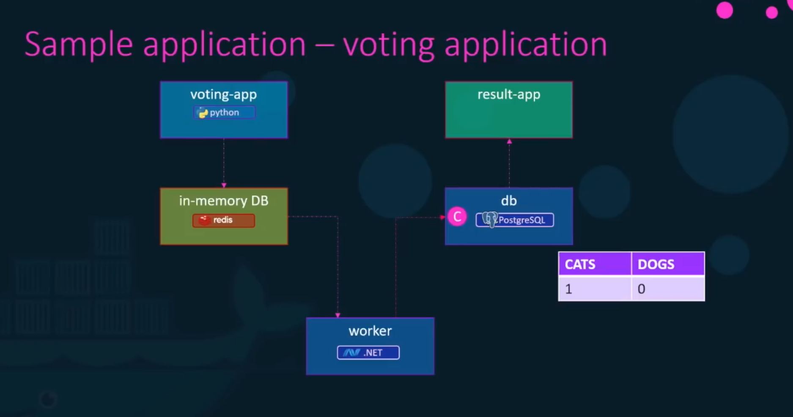
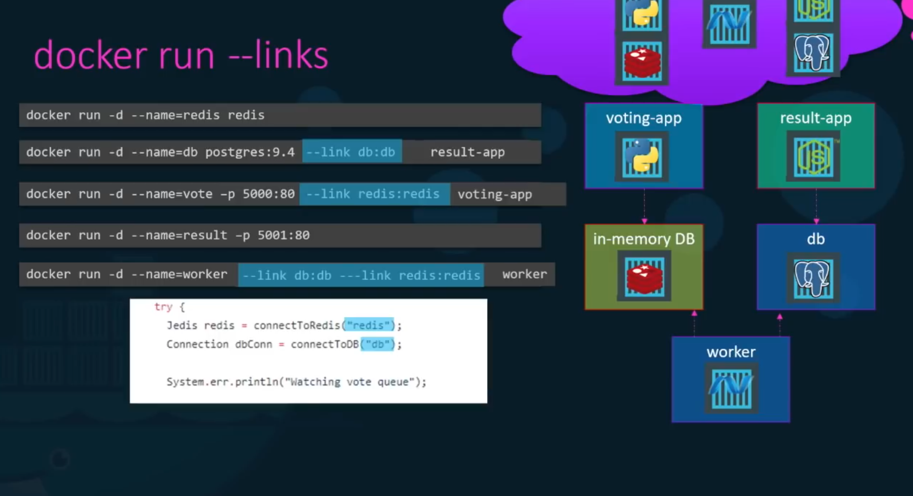
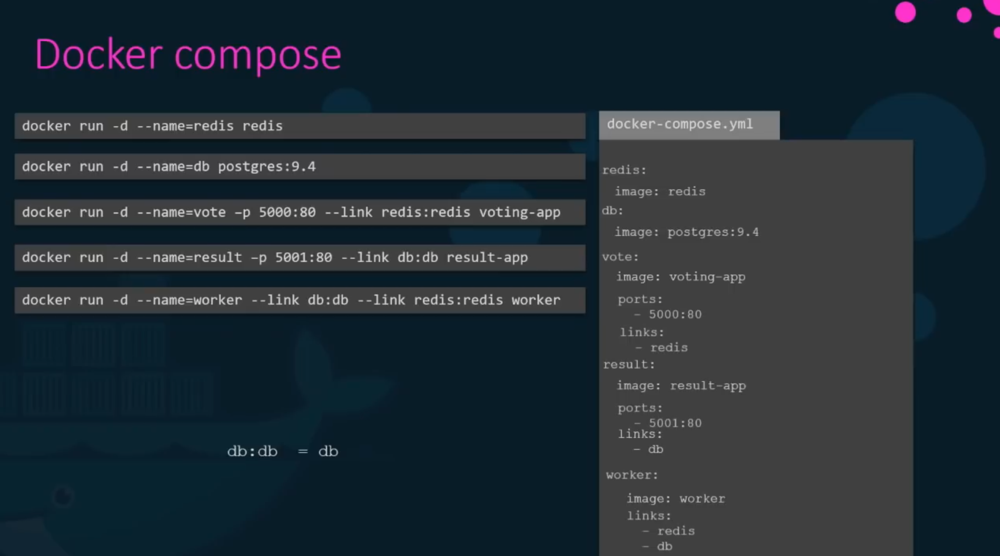

# Useful Commands

[Docker](https://docs.docker.com) is a platform for developers and sysadmins to develop, ship, and run applications. Docker lets you quickly assemble applications from components and eliminates the friction that can come when shipping code. Docker lets you get your code tested and deployed into production as fast as possible.

With Docker, developers can build any app in any language using any toolchain. 'Dockerized' apps are completely portable and can run anywhere - colleagues' macOS and Windows laptops, QA servers running Ubuntu in the cloud, and production data center VMs running Red Hat.

## 1. Installation

- [Installation Guide](https://sourabhbajaj.com/mac-setup/Docker/)

## 2. Useful Docker Commands

### 2.1. `docker build`

Build an image from a Dockerfile.

```bash
docker build [DOCKERFILE PATH]
```

**Example**:

Build an image tagged `my-org/my-image` where the Dockerfile can be found at `/tmp/Dockerfile`.

```bash
docker build -t my-org:my-image -f /tmp/Dockerfile
```

**Useful flags**:

- `--file -f` Path where to find the Dockerfile
- `--force-rm` Always remove intermediate containers
- `--no-cache` Do not use cache when building the image
- `--rm` Remove intermediate containers after a successful build (this is `true`) by default
- `--tag -t` Name and optionally a tag in the `name:tag` format

### 2.2. `docker exec`

Execute a command inside a running container.

```bash
docker exec [CONTAINER ID]
```

**Example**:

```bash
docker exec [CONTAINER ID] touch /tmp/exec_works
```

**Useful flags**:

- `--detach -d` Detached mode: run command in the background
- `-it` This will not make the container you started shut down immediately, as it will create a pseudo-TTY session (`-t`) and keep STDIN open (`-i`)

### 2.3. `docker images`

List all downloaded/created images.

```bash
docker images
```

**Useful flags**:

- `-q` Only show numeric IDs

### 2.4. `docker inspect`

Shows all the info of a container.

```bash
docker inspect [CONTAINER ID]
```

### 2.5. `docker logs`

Gets logs from container.

```bash
docker logs [CONTAINER ID]
```

**Useful flags**:

- `--details` Log extra details
- `--follow -f` Follow log output. Do not stop when end of file is reached, but rather wait for additional data to be appended to the input.
- `--timestamps -t` Show timestamps

### 2.6. `docker ps`

Shows information about all running containers.

```bash
docker ps
```

**Useful flags**:

- `--all -a` Show all containers (default shows just running)
- `--filter -f` Filter output based on conditions provided, `docker ps -f="name="example"`
- `--quiet -q` Only display numeric IDs

### 2.7. `docker rmi`

Remove one or more images.

```bash
docker rmi [IMAGE ID]
```

**Useful flags**:

- `--force -f` Force removal of the image

### 2.8. `docker run`

Creates and starts a container in one operation. Could be used to execute a single command as well as start a long-running container.

**Example**:

```bash
docker run -it ubuntu:latest /bin/bash
```

This will start a ubuntu container with the entrypoint `/bin/bash`. Note that if you do not have the `ubuntu` image downloaded it will download it before running it.

**Useful flags**:

- `-it` This will not make the container you started shut down immediately, as it will create a pseudo-TTY session (`-t`) and keep STDIN open (`-i`)
- `--rm` Automatically remove the container when it exit. Otherwise it will be stored and visible running `docker ps -a`.
- `--detach -d` Run container in background and print container ID
- `-p <host port>:<container port>`: Port mapping container port -> host port
  - Example: `docker run -p 80:5000 kodekloud/simple-webapp`
- `-v <host volume>:<container volume>`: Bind mount a volume. Useful for accessing folders on your local disk inside your docker container, like configuration files or storage that should be persisted (database, logs etc.)
  - Example: `docker run -v /opt/datadir:/var/lib/mysql mysql`
- `-e ENV_VAR=value`: Set a environment variable

### 2.9. `docker volume`

#### Volume Mounting

Create a volume in volumes directory of the host

- Path: `$DOCKER_HOME/volumes/VOLUME_NAME`

```bash
# Create a volume in host
docker volume create VOLUME_NAME

# Mount the volume to a container
docker run -v VOLUME_NAME:/var/lib/mysql mysql
```

#### Bind Mounting

Mount an external directory

```bash
# docker run -v <host path>:<container path> CONTAINER_NAME
docker run -v /data/mysql:/var/lib/mysql mysql
```

### 2.10. Other commands

- `docker version`: Show current version of docker
- `docker pull <image name>`: Pull a docker image from the [Docker hub](https://hub.docker.com)
- `docker inspect <container id>`: Inspect a container
- `docker stop <container id>`: Stop a running container
- `docker rm <container id>`: Remove a container

## 3. Docker Compose

### 3.1. Running containers using docker run command

```bash
docker run redis
docker run postgres:9.4
docker run voting-app
docker run result
docker run worker
```

### 3.2. Running containers using Docker Compose

```yml
# docker-compose.yml
version: 2
services:
    redis:
        image: redis
        networks:
            - back-end
    db:
        image: postgres:9.4
        networks:
            - back-end
    vote:
        build: ./vote   # Build docker image
        ports:
            - 5000:80
        depends_on:
            - redis
        links:
            - redis
    result:
        build: ./result
        ports:
            - 5001:80
        links:
            - db
        networks:
            - front-end
            - back-end
    worker:
        build: ./worker
        links:
            - db
            - redis
        networks:
            - front-end
            - back-end
networks:
    front-end:
    back-end:
```

- Run the stack: `docker-compose up`
  - `-f <filename>`

### 3.3. Example Docker compose stack





## 4. Learn More

- [Docker docs](https://docs.docker.com)
- [Youtube: Docker Tutorial](https://www.youtube.com/watch?v=fqMOX6JJhGo)
- [KodeKloud Hands On Lab](https://beta.kodekloud.com/topic/labs-docker-compose/)
- A list of more useful Docker commands can be found in the [docker-cheat-sheet](https://github.com/wsargent/docker-cheat-sheet).

## 5. Tips and Tricks

A collection of useful tips and tricks for Docker.

### 5.1. Delete all containers

**NOTE**: This will remove ALL your containers.

```bash
docker container prune
```

OR, if you're using an older docker client:

```bash
docker rm $(docker ps -a -q)
```

### 5.2. Delete all untagged containers

```bash
docker image prune
```

OR, if you're using an older docker client:

```bash
docker rmi $(docker images | grep '^<none>' | awk '{print $3}')
```

### 5.3. See all space Docker take up

```bash
docker system df
```

### 5.4. Get IP address of running container

```bash
docker inspect [CONTAINER ID] | grep -wm1 IPAddress | cut -d '"' -f 4
```

### 5.5. Kill all running containers

```bash
docker kill $(docker ps -q)
```

### 5.6. Local Development Environment setup

On Mac, Docker runs on a Virtual Machine.
Containers' ports is exported to the VM's port.
It is required to access to VM to access to the containers.

```bash
# Run MariaDB container
$ docker run -p 3306:3306 -e MARIADB_ROOT_PASSWORD=password mariadb:latest

# Find out VM's IP
$ docker-machine ls
NAME      ACTIVE   DRIVER       STATE     URL                         SWARM   DOCKER      ERRORS
default   *        virtualbox   Running   tcp://192.168.99.100:2376           v19.03.12

# Connect to container via mysql-client
$ mysql -P 192.168.99.100:3306 -u root -p
```
