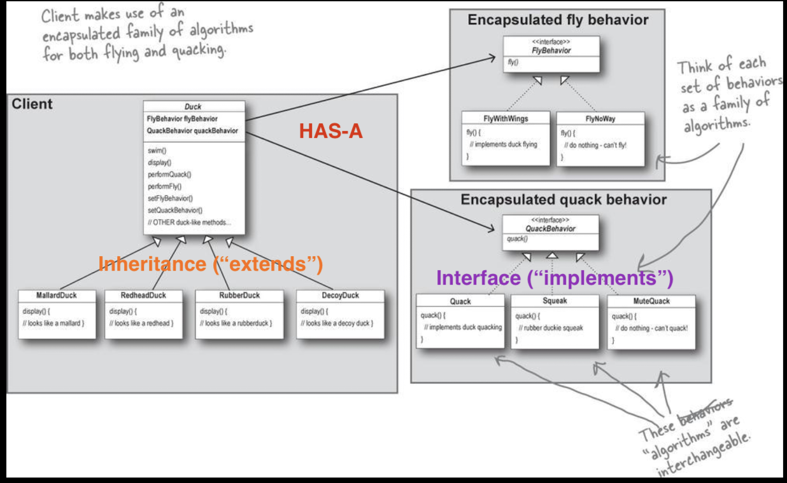
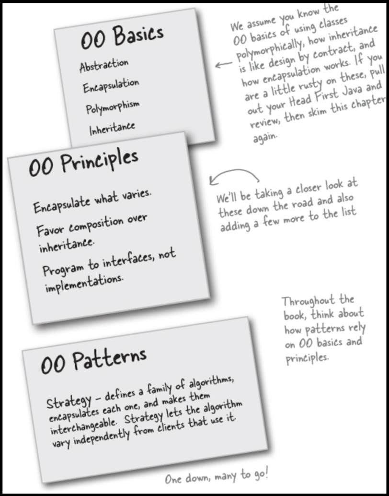

# Chapter 1. Intro to Design Patterns: Welcome to Design Patterns


Someone has already solved your problems.
Instead of code reuse, with patterns you get experience reuse.

## The Strategy Pattern

**The Strategy Pattern** defines a family of algorithms, encapsulates each one, and makes them interchangeable. Strategy lets the algorithm vary independently from clients that use it.

## The Problem

A great use of inheritance for the purpose of reuse hasn’t turned out so well when it comes to maintenance. *A localized update to the code caused a nonlocal side effect* (flying rubber ducks)!

```java
class Duck {
  quack()
  swim()
  display()
  fly()
}

class MallardDuck extends Duck {
  display() {
    // looks like a mallard
  }
}

class RedheadDuck extends Duck {
  display() {
    // looks like a redhead
  }
}

// Oops!! A flying rubber duck!!
class RubberDuck extends Duck {
  quack() {
    // overridden to squeak
  }
  display() {
    // looks like a rubber duck
  }
}
```

## Trials and Errors

We know that *not all of the subclasses should have flying or quacking behavior, so **inheritance isn’t the right** answer.*

```java
interface Flyable {
  fly()
}

interface Quackable {
  quack()
}

class Duck {
  swim()
  display()
}

class MallardDuck extends Duck implements Flyable, Quackable {
  display() {}
  fly() {}
  quack() {}
}

class RedheadDuck extends Duck implements Flyable, Quackable {
  display() {}
  fly() {}
  quack() {}
}

class RubberDuck extends Duck implements Quackable {
  display() {}
  quack() {}
}

class DecoyDuck extends Duck {
  display() {}
}
```

But *while having the subclasses implement Flyable and/or Quackable solves part of the problem* (no inappropriately flying rubber ducks), **it completely destroys code reuse** for those behaviors, so it just creates a different maintenance nightmare.

## The Solution

### Design Principle

> Identify the aspects of your application that vary and separate them from what stays the same.

Take what varies and **encapsulate** it so it won’t affect the rest of your code.

> Program to an interface, not an implementation.

The Duck behaviors will live in a separate class a class that implements a particular behavior interface.

```java
interface FlyBehavior {
  fly()
}

class FlyWithWings {
  fly() {
    // implements duck flying
  }
}

class FlyNoWay {
  fly() {
    // do nothing, can't fly
  }
}
```

*"Program to an interface"* really means ***"Program to a supertype."***

And we could rephrase “program to a supertype” as “the declared type of the variables should be a supertype, *usually an abstract class or interface, so that the objects assigned to those variables can be of any concrete implementation of the supertype,* which means the class declaring them doesn’t have to know about the actual object types!”

```java
// Programming to an implementation would be:
Dog d = new Dog();
d.bark();

// Programming to an interface/supertype would be:
Animal animal = new Dog();
animal.makeSound();

// Even better, rather than hardcoding the instantiation of
// the subtype (like new Dog()) into the code,
// assign the concrete implementation object at runtime:
a = getAnimal();
a.makeSound();
```

### Integrating the Duck Behavior

The key is that a Duck will now *delegate* its flying and quacking behavior, instead of using quacking and flying methods defined in the Duck class (or subclass). Here’s how:

1. First we’ll add two instance variables to the Duck class called `flyBehavior` and `quackBehavior` that are declared as the interface type (not a concrete class implementation type).
2. When a `MallardDuck` is instantiated, its constructor initializes the MallardDuck’s inherited quackBehavior instance variable to a new instance of type Quack (a QuackBehavior concrete implementation class).

### The Big Picture on encapsulated behaviors



#### HAS-A can be better than IS-A

The HAS-A relationship is an interesting one: each duck has a `FlyBehavior` and a `QuackBehavior` to which it *delegates* flying and quacking. When you put two classes together like this you’re using **composition**. Instead of *inheriting* their behavior, the ducks get their behavior by being *composed* with the right behavior object.

> Favor composition over inheritance.

As you’ve seen, creating systems using composition gives you a lot more flexibility. Not only does it let you encapsulate a family of algorithms into their own set of classes, but it also lets you *change behavior at runtime* as long as the object you’re composing with implements the correct behavior interface.

### Tools for your Design Toolbox



- Knowing the OO basics does not make you a good OO designer.
- Good OO designs are reusable, extensible, and maintainable.
- Patterns show you how to build systems with good OO design qualities.
- Patterns are proven object-oriented experience.
- Patterns don’t give you code, they give you general solutions to design problems. You apply them to your specific application.
- Patterns aren’t *invented* , they are *discovered*.
- Most patterns and principles address issues of change in software.
- Most patterns allow some part of a system to vary independently of all other parts.
- We often try to take what varies in a system and encapsulate it.
- Patterns provide a shared language that can maximize the value of your communication with other developers.
