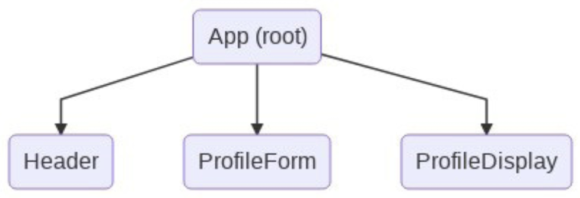
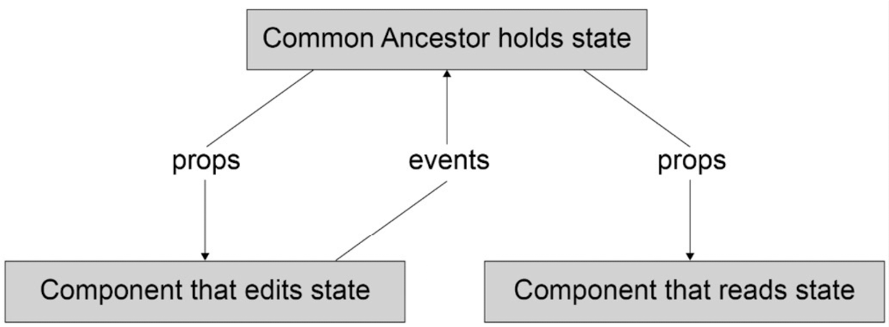
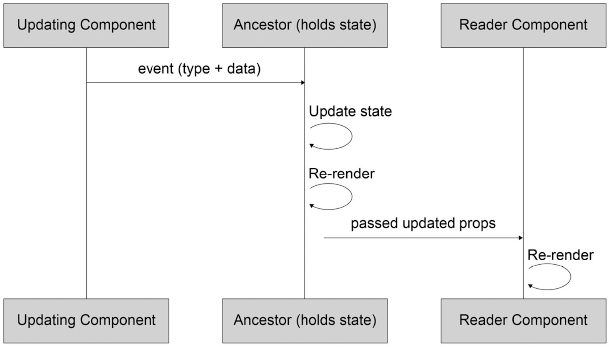

# Frontend Development Projects with Vue.js 3

## Ch 01. Starting Your First Vue Project

### Option API vs Composition API

```vue
<!-- Option API -->
<template>
  <Exercise />
</template>

<script>
import Exercise from './components/Exercise1-01'

export default {
  components: {
    Exercise,
  },
  data() {
    return {
      color: 'red'
    }
  }
}
</script>

<!-- Composition API -->
<script setup>
import logo from 'components/logo.vue'

const color = 'red';
</script>

<template>
  <header>
    <a href="mywebsite.com">
      <logo />
    </a>
  </header>

  <div>{{color}}</div>
</template>
```

### Understanding Vue directives

#### `v-text`

The `v-text` directive has the same reactivity as with interpolation. Interpolation with `{{ }}` is more performant than the v-text directive. However, you may find yourself in situations where you have pre-rendered text from a server and want to override it once your Vue application has finished loading.

```vue
<template>
  <div v-text="msg">My placeholder</div>
</template>
<script setup>
const msg = "My message"
</script>
```

#### `v-once`

When used, it indicates the starting point of static content. The Vue engine will render the component with this attribute and its children exactly once. It also ignores all data updates for this component or element after the initial render.

#### `v-html`

Vue will parse the value passed to this directive and render your text data as a valid HTML code into the target element. We don't recommend using this directive, especially on the client side, due to its performance impact and the potential security leak. The script tag can be embedded and triggered using this directive.

#### `v-bind`

This directive is one of the most popular Vue features. You can use this directive to enable one-way binding for a data variable or an expression to an HTML attribute, as shown in the following example:

```vue
<script setup>
const logo = '../assets/logo.png';
</script>

<template>
  

  <!-- A shorter way is using the :attr syntax instead of v-bind:attr  -->
  
</template>
```

#### `v-if`

This is a powerful directive you can use to conditionally control how elements render inside a component.

```vue
<template>
  <div v-if="count === 2">Two</div>
  <div v-else-if="count === 4">Four</div>
  <div v-else-if="count === 6">Six</div>
  <div v-else>Others</div>
</template>
```

#### `v-show`

You can also control the visible state of HTML elements by using `v-show`. If `v-show` results in a `true` Boolean, it will leave the DOM element as is. If it resolves as `false`, it will apply the `display: none` style to the element.

#### `v-for`

We use the `v-for` directive to accomplish the goal of list rendering based on a data source.

### Enabling two-way binding using `v-model`

Vue achieves two-way data binding by creating a dedicated directive that watches a data property within your Vue component. The `v-model` directive triggers data updates when the target data property is modified on the UI. This directive is usually useful for HTML form elements that need to both display the data and modify it reactively.

```vue
<template>
    <input v-model="name" />
</template>
<script>
  export default {
    data() {
      return {
        name: ''
      }
    }
  }
</script>
```

- Binding a huge amount of data using v-model can affect the performance of your application.
- Vue data in the local state is not immutable and can be redefined anywhere in the template.

### Basic iteration using `v-for`

The basic syntax of `v-for` is as follows:

`v-for="(item, index) in items" :key="index"`

```vue
<template>
<div v-for="n in 5" :key="`loop-2-${n}`">
    {{ n }}
</div>

<!-- Iterating through an array of objects -->
<ul>
  <li v-for="(item, index) in items" :key="item.id">
    <h2>{{ item.title }}</h2>
    <span>{{ item.description }}</span>
  </li>
</ul>
</template>

<!-- Iterating through the properties of Object -->
<script setup>
const information = {
  title: "My list component information",
    subtitle: "Vue JS basics",
    items: ["Looping", "Data", "Methods"],
  }
</script>
<template>
  <div>
    <div v-for="(value, key) in information" :key="key">
      {{key}}: {{ value }}
    </div>
  </div>
</template>
```

### Exploring methods

In Vue 2.0, Vue defines component methods inside the methods object as part of a Vue instance. You compose each component method as a normal JavaScript function. The Vue method is scoped to your Vue component and can be run from anywhere inside the component it belongs to. It also has access to the `this` instance, which indicates the instance of the component:

```vue
<script>
export default {
  methods: {
    myMethod() { console.log('my first method'); }
  }
}
</script>

<!-- From Vue 3.0 -->
<script setup>
const myMethod = () => { console.log('my first method'); }
</script>

<template>
  <button id="click-me" v-on:click="myMethod">Click me</button>
  <button id="click-me" @click="myMethod">Click me shorter</button>
</template>
```

When binding events to HTML elements in Vue, you would use the `@` symbol. For example, `v-on:click` is equivalent to `@click`.

### Understanding component lifecycle hooks

The Vue component lifecycle events happen during a component's lifecycle, from creation to deletion. They allow us to add callbacks and side effects at each stage of the component's life when necessary. Vue executes the events in order, as follows:

1. `setup`: This event runs before all other hooks, including `beforeCreate`. It doesn't have access to this instance since the instance has not yet been created at this point. It is mainly for using Composition API and is treated in the same way Vue treats script setup.
2. `beforeCreate`: This runs when your component has been initialized. data has not been made reactive and events are not set up in your DOM.
3. `created`: You will be able to access reactive data and events, but the templates and DOM are not mounted or rendered. This hook is generally good to use when requesting asynchronous data from a server since you will more than likely want this information as early as possible before the virtual DOM is mounted.
4. `beforeMount`: A very uncommon hook, as it runs directly before the first render of your component and is not called Server-Side Rendering.
5. `mounted`: Mounting hooks are among the most common hooks you will use since they allow you to access your DOM elements so that non-Vue libraries can be integrated.
6. `beforeUpdate`: This runs immediately after a change to your component occurs and before it has been re-rendered. It's useful for acquiring the state of reactive data before it has been rendered.
7. `updated`: It runs immediately after the `beforeUpdate` hook and re-renders your component with new data changes.
8. `beforeUnMount`: This is fired directly before unmounting your component instance. The component will still be functional until the unmounted hook is called, allowing you to stop event listeners and subscriptions to data to avoid memory leaks. Note this event is called `beforeDestroy` in Vue 2.x.
9. `unmounted`: All the virtual DOM elements and event listeners have been cleaned up from your Vue instance. This hook allows you to communicate that to anyone or any element that needs to know this has been done. This event in Vue 2.x is called `destroyed`.

### Styling components

When using Vue components, the Vite compiler allows you to use almost any frontend templating language style.

Another benefit of using Vue is scoping the style with the scoped attribute. This is a useful way to create isolated and component-specific CSS stylings. It also overrides any other CSS global rules, according to the CSS rule of specificity.

It is not recommended to scope global styles. A common method for defining global styling is to separate these styles into another style sheet and import them into your App.vue file.

### Understanding CSS modules

A recent pattern that has become popular in the reactive framework world is CSS modules. Vue components help to solve this by being modular and allowing you to compose CSS that will generate unique class names for the specific component at compile time.

Using CSS modules in Vue exports CSS styles from the style section into JavaScript modules and uses those styles in the template and logic computing. To enable this feature in Vue, you will need to add the module attribute to the style block, and reference as classes using the `:class` and `$style.<class name>` syntax, as shown here:

```vue
<template>
  <div :class="$style.container">CSS modules</div>
</template>

<style module>
.container {
  width: 100px;
  margin: 0 auto;
  background: green;
}
</style>
```

## Ch 02. Working with Data

### Understanding computed properties

Computed properties are unique data types that will reactively update only when the source data used within the property is updated.

```vue
<script>
export default {
  data() {
    return {
      yourData: "your data"
    }
  },
  computed: {
    yourComputedProperty() {
      return `${this.yourData}-computed`;
    }
  }
}
</script>
```

Let's look at some examples of where you should consider using a computed property:

- Form validation
- Combining data props
- Calculating and displaying complex information: Sometimes there is a need to perform an extra calculation or to extract specific information from one large data object source.

### Understanding computed setters

By default, computed data is a getter only, which means it will only output the outcome of your expression. In some practical scenarios, when a computed property is mutated, you may need to trigger an external API or mutate the original data elsewhere in the project. The function performing this feature is called a **setter**.

```vue
<script>
export default {
  data() {
    return {
      count: 0
    }
  },
  method: {
    callAnotherApi() { /* do something */ }
  },
  computed: {
    myComputedDataProp: {
      get() {
        return this.count + 1
      },
      set(value) {
        this.count = value - 1
        this.callAnotherApi(this.count)
      },
    },
  },
}
</script>
```

### Exploring watchers

Vue watchers programmatically observe component data and run whenever a particular property changes. Watched data can contain two arguments: `oldVal` and `newVal`. This can help you when writing expressions to compare data before writing or binding new values. Watchers can observe objects as well as other types, such as `string`, `number`, and `array` types.

If the `immediate` key is set to `true` on a watcher, then when this component initializes, it will run this watcher on creation. You can watch all keys inside any given object by including the key and value `deep: true` (the default is `false`).

To clean up your watcher code, you can assign a `handler` argument to a defined component's method, which is considered best practice for large projects. Watchers complement the usage of computed data since they passively observe values and cannot be used as normal Vue data variables, while computed data must always return a value and can be looked up. Remember *not* to use arrow functions if you need the Vue context of `this`.


```vue
<script>
export default {
  watch: {
    myDataProperty: {
      handler: function(newVal, oldVal) {
        console.log('myDataProperty changed:', newVal, oldVal)
      },
      immediate: true,
      deep: true
    },
  }
}
</script>
```

If you do not need to observe every key inside an object, it is more performant to assign a watcher to a specific key by specifying it following the syntax <object>.<key> string.

```vue
<script>
export default {
  data() {
    return {
      organization: {
        name: 'ABC',
        employees: ['Jack', 'Jill']
      }
    }
  },
  watch: {
    'organization.name': {
      handler: function(v) {
        this.sendIntercomData()
      },
      immediate: true,
    },
  },
}
</script>
```

### Comparing methods, watchers, and computed properties

Methods are best used as a handler to an event occurring in the DOM, and in situations where you need to call a function or perform an API call, for example, `Date.now()`. All values returned by methods are not cached.

Methods should not be used to display computed data, since the return value of the method, unlike computed props, is not cached, potentially generating a performance impact on your application if misused.

As mentioned, computed props are best used when reacting to data updates or for composing complicated expressions in your template. Computed properties also help increase the readability of your Vue component's template and logic.

However, in many cases, using computed props can be overkill, such as when you only want to watch a specific data's nested property rather than the whole data object. Or when you need to listen and perform an action upon any changes of a data property or a specific property key nested inside a data property object, and then perform an action. In this case, data watchers should be used.

## Ch 03. Vite and Vue Devtools

### Using Vite

`Vite.js` is the build management tool aiming to do the following:

- Help you develop faster (locally develop your project with a more time-saving approach)
- Build with optimization (bundle files for production with better performance)
- Manage other aspects of your web project effectively (testing, linting, and so on)

### Using Vue Devtools

Vue Devtools is a browser extension for Chrome and Firefox and an Electron desktop app. You can install and run it from your browser to debug your Vue.js projects during development. This extension does not work in production or remotely run projects. You can download the Vue Devtools extension from the Chrome extension page.

## Ch 04. Nesting Components (Modularity)

### Passing props

**Props** in the context of Vue are fields defined in a child component accessible on that component's instance (`this`) and in the component's `template`. The `props` property of a Vue component can be an array of strings or an object literal, each property field of which is a component's prop definition.

```vue
<!-- Defining a simple component that accepts props -->
<template>
  <div class="hello">
    <h1>{{ msg }}</h1>
    <!-- … -->
  </div>
</template>

<script>
export default {
  name: 'HelloWorld',
  props: ['msg']
}
</script>

<!-- Passing props to a component -->
<script setup>
import HelloWorld from "./components/HelloWorld.vue";
</script>

<template>
<div id="app">
    <HelloWorld msg="Vue.js"/>
  </div>
</template>
```

### Binding reactive data to props

What if we want to pass reactive data from the parent to the child? This is where **binding** comes in. You can use `v-bind`: (or `:` for short) to enable one-way binding of a parent's reactive data to the child component's props.

```vue
<script setup>
import HelloWorld from './components/HelloWorld.vue'
const appWho = 'Vue.js'
</script>

<template>
  <div id="app">
    <HelloWorld :msg="appWho"/>
  </div>
</template>
```

### Understanding prop types and validation

#### Primitive prop validation

```vue
<script>
export default {
  props: {
    times: {
      type: Number
    },
    content: {
      type: String
    }
  },
  computed: {
    repetitions() {
      return Array.from({ length: this.times });
    }
  }
}
</script>

<template>
  <div>
    <span v-for="r in repetitions" :key="r">
      {{ content }}
    </span>
  </div>
</template>

<!-- We can also use any valid JavaScript constructor as a prop's type,
such as a Promise or a custom User class constructor. -->
<script setup>
import User from './user.js'
export default {
  props: {
    todoListPromise: {
      type: Promise
    },
    currentUser: {
      type: User
    }
  }
}
</script>
```

#### Custom validation of arrays and objects

Vue allows custom validators to be used as props using the validator property.

```vue
<script>
export default {
  props: {
    selected: {
      type: String
    },
    options: {
      type: Array,
      validator(options) {
        return options.every(o => Boolean(o.value
          && o.label))
      }
    }
  }
}
</script>

<template>
  <select>
    <option
      :selected="selected === o.value"
      v-for="o in options"
      :key="o.value"
    >
      {{ o.label }}
    </option>
  </select>
</template>
```

#### Understanding required props

To mark a prop as required, we can use the `required` prop type property.

```vue
<script>
export default {
  // other component properties
  props: {
    selected: {
      type: String,
      required: true
    }
    // other prop definitions
  }
}
</script>
```

#### Setting the default props value

```vue
<script>
export default {
  props: {
    // other props
    limit: {
      type: Number,
      default: 2,
    },
    offset: {
      type: Number,
      default: 0,
    }
  },
  // other component properties
}
</script>
```

In cases where a prop is an array or an object, we can't assign its `default` value with a static array or object. Instead, we need to assign it a function that returns the desired default value.

```vue
<script>
export default {
  props: {
    items: {
      type: Array,
      default() {
        return []
      }
    }
    // other props
  },
  // other component properties
}
</script>
```

#### Registering props in `<script setup>` (setup hook)

If you use `<script setup>`, since there is no options object, we can't define the component's props using the props field. Instead, we use the `defineProps()` function from the vue package.

```vue
<script setup>
import { defineProps, computed } from  'vue'
const props = defineProps({
  items: {
    type: Array,
    required: true,
  },
  limit: {
    type: Number
  },
  offset: {
    type: Number
  }
});
const currentWindow = computed(() => {
  return props.items.slice(props.offset, props.limit)
})
</script>
```

`defineProps()` returns an object containing all the props' values. We can then access a prop such as items using `props.items` instead within the `script` section, and `items` as usual in the `template` section.

### Understanding slots, named slots, and scoped slots

**Slots** are sections of a component where the template/rendering is delegated back to the parent of the component. We can consider slots as templates or markup that are passed from a parent to a child for rendering in its main template.

#### Passing markup to a component for rendering

The simplest type of slot is the default child slot.

```vue
<!-- We can define a Box component with a slot as follows: -->
<template>
  <div>
    <slot>Slot's placeholder</slot>
  </div>
</template>

<!-- The following markup is for the parent component (src/App.vue):  -->
<template>
  <div>
    <Box>
      <h3>This whole h3 is rendered in the slot with parent count {{ count }}</h3>
    </Box>
    <button @click="count++">Increment</button>
  </div>
</template>

<script>
import Box from './components/Box.vue'
export default {
  components: {
    Box
  },
  data() {
    return { count: 0 }
  }
}
</script>
```

Slots are a way to let the parent have control over rendering a section of a child's template. Any references to instance properties, data, or methods will use the parent component instance. This type of slot does not have access to the child component's properties, props, or data.

#### Using named slots to delegate rendering of multiple sections

We use named slots when a child component wants to allow its parent to customize the multiple sections in its template. For example, an `Article` component might delegate rendering of `title` and `excerpt` to its parent.

```vue
<!-- Child -->
<template>
  <article>
    <div>Title: <slot name="title" /></div>
    <div>Excerpt: <slot name="excerpt" /></div>
  </article>
</template>

<!-- Parent -->
<template>
  <div>
    <Article>
      <template v-slot:title>
        <h3>My Article Title</h3>
      </template>
      <template v-slot:excerpt>
        <p>First paragraph of content</p>
        <p>Second paragraph of content</p>
      </template>
    </Article>
  </div>
</template>
<script>
import Article from './components/Article.vue'
export default {
  components: {
    Article
  }
}
</script>
```

The shorthand syntax for `v-slot:slot-name` is `#slot-name`. We can refactor our template that consumes Article as follows:

```vue
<template>
  <div>
    <Article>
      <template #title>
        <h3>My Article Title</h3>
      </template>
      <template #excerpt>
        <p>First paragraph of content</p>
        <p>Second paragraph of content</p>
      </template>
    </Article>
  </div>
</template>
```

Note here that `v-slot` cannot be used with native elements. You can only use it with `template` and/or with the component itself. For example, the following `<template>` section attempts to set a `v-slot` on a `h3` element:

```vue
<template>
  <div>
    <Article>
      <h3 v-slot:title>My Article Title</h3>
    </Article>
  </div>
</template>
```

This template will fail with a compilation error of `v-slot can only be used on components or <template>`.

#### Using scoped slots to wrap prop-passing logic

The types of slots we have explored so far only have access to the component instance where slot template content is passed - the parent component.

In many scenarios, it is handier to let the parent component decide how to render the UI while letting the child component handle the data and pass it to the slot. We use scoped slots for this purpose.

A **scoped slot** starts with the child component's slots, where the `slot` element receives props and passes them to the related template content by using `v-bind` or the shorthand, `:`.

```vue
<!-- Child  -->
<template>
  <ul>
    <li
      v-for="el in currentWindow"
      :key="el.id"
    >
      <slot :item="el" />
    </li>
  </ul>
</template>
<script>
export default {
  props: ['items', 'limit', 'offset'],
  computed: {
    currentWindow() {
      return this.items.slice(this.offset, this.limit)
    }
  }
}
</script>

<!-- Parent  -->
<script>
import PaginatedList from './components/PaginatedList.vue'
export default {
  components: {
    PaginatedList
  },
  data() {
    return {
      snacks: [
        {
          id: 'ready-salted',
          content: 'Ready Salted'
        },
        {
          id: 'cheese-onion',
          content: 'Cheese & Onion'
        },
        {
          id: 'salt-vinegar',
          content: 'Salt & Vinegar'
        },
      ]
    }
  }
}
</script>

<template>
  <div>
    <PaginatedList :items="snacks">
      <template #default="{ item }">
        {{ item.content }}
      </template>
    </PaginatedList>
  </div>
</template>
```

### Understanding Vue refs

In Vue, **refs** are references to DOM elements or other component instances that have been mounted to the DOM. One of the major use cases for refs is direct DOM manipulation and integration with DOM-based libraries (that usually take a DOM node they should mount to), such as an animation library.

We define refs by using the syntax `ref="name"` on a native element or child component in the template.

```vue
<template>
  <div id="app">
    <input ref="theInput" />
    <button @click="focus()">Focus Input</button>
  </div>
</template>
<script>
export default {
  methods: {
    focus() {
      this.$refs.theInput.focus()
    }
  }
}
</script>
```

Note here that we can only access `$refs` once the component is mounted to the DOM. Hence `this.$refs.theInput` in our example is only available in the `mounted()` life cycle hook. Also, if you use `<script setup>`, there is no `$refs` available since there is no this and setup runs before the component instance is created. Hence to use DOM references with `<script setup>` or the `setup` hook, we use the `ref()` function from the Composition API instead.

### Using events for child-parent communication

To pass data from a child component back to a parent component, Vue offers custom events.

In a component, we can emit an event using the `$emit` method; with `this.$emit('eventName', payload)` within `<script>`; or just with `$emit` within the `template` section.

```vue
<script>
export default {
  data () {
    return {
      message: null
    }
  },
  methods: {
    send() {
      this.$emit('send', this.message);
    }
  }
}
</script>
<!-- In the same scenario, we could trigger a send event from the template section as follows: -->
<template>
  <div>
    <input v-model="message" />
    <button @click="$emit('send', message)">Emit inline</button>
  </div>
</template>
```

From a parent component, we can use `v-on:event-name` or the shorthand `@event-name`. `event-name` must match the name passed to `$emit`. Note `eventName` and `event-name` are not equivalent.

```vue
<template>
  <div id="app">
    <p>Message: {{ parentMessage }}</p>
    <MessageEditor @send="updateParentMessage" />
    <button @click="parentMessage = null">Reset</button>
  </div>
</template>
<script>
import MessageEditor from './components/MessageEditor.vue'
export default {
  components: {
    MessageEditor
  },
  data() {
    return {
      parentMessage: null
    }
  },
  methods: {
    updateParentMessage(newMessage) {
      this.parentMessage = newMessage
    }
  }
}
</script>
```

Custom events support passing any JavaScript type as the payload. The event name, however, must be a `String`.

#### Registering events with `<script setup>` (or `setup` hook)

If you use `<script setup>`, since there is no component's options object, we can't define custom events using the `emits` field. Instead, we use the `defineEmits()` function from the vue package and pass all the relevant events' definitions to it.

```vue
<script setup>
import { defineEmits, ref } from  'vue'
const message = ref(null)
const emits = defineEmits(['send'])
emits('send', message.value);
</script>
```

## Ch 05. Composition API

### Creating components with the `setup()` lifecycle method

`setup()` is the first hook the Vue engine will run in a component's lifecycle before the beforeCreate() hook. At this point, Vue hasn't defined a component instance or any component data.

`setup()` accepts two arguments, which are as follows:

- `props`: All the reactive props data is passed to the component from its parent. You need to declare the props using the `props` field in the Options API as usual. Note that you shouldn't de-structure the `props` object to avoid losing the reactivity for the de-structured field.
- `context`: These are all the non-reactive fields for the component, such as `attrs`, `slots`, `emit`, and `expose`.

```vue
<script setup>
const message = 'Hello World'
</script>

<!-- The preceding code is equal to the following using setup():  -->
<script>
export default {
  setup(props, context) {
    const message = 'Hello World'
    return {
      message
    }
  }
}
</script>
```

With `<script setup>`, if you need to use the props parameter, you need to import `defineProps()` from the vue package and define the props within the `<script setup>` section, as shown in the following example:

```vue
<script setup>
import { defineProps } from 'vue'
const { userName } = defineProps({ userName: string });
</script>
```

### Creating a component with `setup()` and `h()`

In many scenarios where you need to render a static functional component or a static component structure based on the context and props received, using `h()` and `setup()` can be helpful. The `h()` function syntax is as follows:

  `h(Element, props, children)`

`h()` receives the following parameters:

- A string representing a DOM element (`div`, for instance) or a Vue component.
- The props to pass to the created component node, including native properties and attributes, such as `class`, `style`, and so on, and event listeners. This parameter is optional.
- The array of children for the component or object of the slot functions. This parameter is also optional.

Instead of returning the object containing a static internal data state and using the template section, `setup()` will return a function that returns the component node created by the `h()` function based on the parameters received.

```vue
<script>
import { h } from 'vue';
export default {
 setup() {
   const message = 'Hello World'
   return () => h('div', { style: { color: 'blue' } }, message)
 }
}
</script>
```

### Working with data

In the Options API, we use the `data()` method to initialize a component's local state. By default, all the data properties received from `data()` are reactive, which can be overkill in many scenarios.

Vue has introduced the `ref()` and `reactive()` functions, which allow us to decide which local states should be reactive and which shouldn't be.

#### Setting a reactive local state with `ref()`

`ref()` is a function that accepts a single input parameter as the reactive data's initial value and returns a reference object for the created reactive data state. We call this reference object a ref object.

To start using ref(), you first need to import it from the vue package. For example, we can create a reactive data called isLightOn, which accepts false as its initial value as follows:

```vue
<script setup>
import { ref } from 'vue';
const isLightOn = ref(false);
const toggle = () => {
  console.log(isLightOn.value)
};
</script>

<template>
  <div>Light status: {{ isLightOn }}</div>
</template>
```

`ref()` is generally sufficient to create a reactive state for any data types, including primitive (`boolean`, `number`, `string`, and so on) and object types.

However, for an object type, using `ref()` means that Vue will make the desired data object and its nested properties reactive and mutable.

Unfortunately, this mechanism of making the object and its nested properties reactive can lead to unwanted bugs and potential performance issues, especially for reactive objects with a complex hierarchy of nested properties.

In a scenario in which you only want to modify the whole object's value (replacing it with a new object) but not its nested properties, we suggest you use `shallowRef()`.

In a scenario in which you only need to modify the object's nested properties (such as elements of an array object and each element's fields), you should use `reactive()` instead.

### Setting a reactive local state with `reactive()`

Like `ref()`, the `reactive()` function returns a reference to a reactive object based on the initial value passed to it. Unlike `ref()`, `reactive()` only accepts object-type input parameters and returns a reference object whose value can be accessed directly without needing a `.value` field.

```vue
<script setup>
import { reactive } from "vue";
const newBook = reactive({
  title: "",
  price: 0,
  currency: "USD",
  description: "",
});
const books = reactive([]);
</script>

<template>
  <fieldset :style="{ display: 'flex', flexDirection: 'column'}">
    <label>
      Title:
      <input v-model="newBook.title" />
    </label>
    <label>
      Price:
      <input v-model.number="newBook.price" />
    </label>
    <label>
      Currency:
      <input v-model="newBook.currency" />
    </label>
    <label>
      Description:
      <input v-model="newBook.description" />
    </label>
    <button @click="addBook">Add</button>
  </fieldset>
</template>
```

```js
const addBook = () => {
  books.push({
    ...newBook,
  });
  newBook.title = "";
  newBook.price = 0;
  newBook.currency = "USD";
  newBook.description = "";
};
```

Note that here, we don't push `newBook` directly to `books` but rather clone its properties to the new object using the spread literal, `…`, instead. `reactive()` only creates a proxy version of the original object passed to it. Hence, if you don't clone newBook before adding it to books, any changes made to its properties later will also be reflected in the element added to the books list.

You can also use `shallowReactive()` to limit the reactivity mechanism to apply only to the root's properties and not their descendants.

### Computing a reactive state from another local state with `computed()`

Like computed() in the Options API, computed() is for creating new reactive data based on other reactive data for a component. It accepts a function that returns the reactive data value as its first parameter. It will return a read-only and cached reference object:

```vue
<script setup>
import { computed } from 'vue'
const computedData = computed(() => { /* … */ })
</script>
```

You can also make the computed data writable by passing an object with a setter and getter to `computed()` instead of a function. However, **we do not recommend doing so** as general good Vue practice.

### Using watchers with `watch()`

`const watcher = watch(source, handler, options)`

`watch()` accepts three parameters, including the following:

- `source` as a single target data object or getter function (which returns the data's value) to watch, or an array of targets.
- `handler` is the function that Vue executes whenever source changes. The handler function receives `newValue` and `oldValue` as its source's next value and previous value respectively. It also accepts the third argument as its side-effect cleanup method. Vue will trigger this clean-up function before the next handler is invoked - if any are.
- `options` are the additional configurations for the watcher, including the following:
  - Two `boolean` flags: `deep` (whether Vue should watch over the nested properties of the source) and `immediate` (whether to invoke the handler immediately after the component is mounted).
  - `flush` as the execution order for the handler (`pre`, `post`, or `sync`). By default, Vue executes the handler in the `pre` order (before updating).
  - Two debugging callbacks, `onTrack` and `onTrigger`, for development mode.

```js
import { ref, watch } from 'vue';
const searchTerm = ref('');
const searchTermWatcher = watch(
  searchTerm,
  (newValue, oldValue) => console.log(
    `Search term changed from ${oldValue} to ${newValue}`
  )
);
```

Unlike the watch property from the Options API, the `watch()` method returns a stopper function to stop the watcher whenever you no longer need to observe the target data. Also, in a scenario in which you explicitly wish to watch a nested data property, you can define the target source as a getter function that returns that specific data property.

### Understanding composable lifecycle functions

- `onBeforeMount()`: Before the first render of the component
- `onMounted()`: After rendering and mounting the component to the DOM
- `onBeforeUpdate()`: After starting the component's update process, but before the actual rendering of the updated component
- `onUpdated()`: After rendering the updated component
- `onBeforeMount()`: Before the process of unmounting the component starts
- `onUnmounted()`: After the component's instance has been destroyed

Since we use `setup()` or `<script setup>` to define the component's data and internal logic in combination with other Composition API, there is no need for equivalent versions of `created()` and `beforeCreate()` from the Options API.

### Creating your composable (custom hook)

In many scenarios, we want to group some components' logic into reusable code blocks for other components that share similar functionalities. *In Vue 2.x, we use mixins to achieve this goal.* However, mixins are not the best practical solution, and they can create code complexity due to the order of merging and invoking overlapping data and lifecycle hooks.

Starting from Vue 3.0, you can use the Composition API to divide the common data logic into small and isolated composables, using them to create a scoped data control in different components and return the created data if there is any.

```js
// src/composables/useMessages.ts
import { ref } from 'vue'
export const useMessages = () => {
  const messages = ref([
   "Apex Legends",
   "A Plague Tale: Innocence",
   "ART SQOOL",
   "Baba Is You",
   "Devil May Cry 5",
   "The Division 2",
   "Hypnospace Outlaw",
   "Katana ZERO",
  ]);
  const deleteMessage = (value) => {
   messages.value = messages.value.filter((item) => item
     !== value);
  };
  const addMessage = (value) => {
   messages.value.push(value)
  }
  return { messages, deleteMessage, addMessage }
}

// To use useMessages() in your component, you can import it into the component's <script setup> section,

<script setup>
import { useMessages } from '@/composables/useMyComposable'
const { messages, deleteMessage, addMessage } = useMessages ()
</script>
```

## Ch 06. Global Component Composition

### Understanding mixins

With mixins, we can add additional methods, data properties, and life cycle methods to a component's option object. In the following example, we first define a mixin that contains a greet method and a greeting data field:

```js
/** greeter.js */
export default {
  methods: {
    greet(name) {
        return `${this.greeting}, ${name}!`;
    }
  },
  data() {
    return {
      greeting: 'Hello'
    }
  }
}
```

Then we can use the `greeter` mixin by importing and assigning it as part of the mixins field in the component's option object, as follows:

```vue
<script>
import greeter from './mixins/greeter.js'
export default {
  mixins: [greeter]
}
</script>
```

`mixins` is an array that accepts any mixin as its element, while a `mixin` is in fact a component's option object. Mixins allow multiple components to share common data and logic definitions independently.

When there is an overlapping of naming data properties or methods, Vue will prioritize the component's own options. However, this mechanism doesn't apply to life cycle hooks. The hooks defined in the mixins will take priority in execution, and Vue always triggers the component's hooks last.

Due to the mechanism of data overriding and executing for hooks, mixins can lead to potential bugs and unwanted behaviors in a large code base. *Thus, we recommend considering creating shared logic and data as composable with Composition API whenever possible instead.*

### Understanding plugins

Vue plugins are a way to add custom functionality to Vue.js globally. Classic examples of plugin candidates are translation/internationalization libraries (such as `i18n-next`) and HTTP clients (such as the `axios`, `fetch`, and `GraphQL` clients).

A Vue plugin is an object that exposes an `install` method. The `install` function is called with an `app` instance and `options`:

```js
const plugin = {
  install(app, options) {}
}
```

Within the `install` method, we can register directives and components and add global and instance properties and methods:

```js
const plugin = {
  install(app, options) {
    app.directive('fade', { bind() {} })
    app.component(/* Register component globally */)
    app.provide(/* Provide a resource to be injectable */)
    app.config.globalProperties.$globalValue = 'very-global-value'
  }
}
```

We can register a plugin using the `use` instance method, as follows:

```js
import plugin from './plugin'
const app = createApp(/*…*/)
app.use(plugin)
```

### Globally registering components

A reason for using plugins is to reduce boilerplate in all Vue application files by removing imports and replacing it with access to this. Much for the same reasons as we define global methods and properties, we might want to register components globally.

```vue
/** CustomButton.vue */
<template>
  <button @click="$emit('click', $event)">
    <slot />
  </button>
</template>
```

```js
/** main.js */
import CustomButton from './components/CustomButton.vue'
app.component('CustomButton', CustomButton)
```

### Using non-SFC Vue components

- Runtime definition with a string template
- `render` function
- JSX
- Components: `<component :is="componentName" />`

## Ch 07. Routing

`Vue Router` is the official router service for any Vue.js application.

### Exploring the `RouterView` element

`RouterView` is a Vue component whose job is to do the following:

- Render different child components
- Mount and unmount itself automatically at any nesting level, depending on the route's given path

### Passing props to view

Since `RouterView` is a component, it can also receive props. The only prop it receives is `name`, which is the same name registered in the corresponding route's record defined in the `router` object at the initialization phase.

The Vue engine automatically passes any other additional HTML attributes to any view component that RouterView renders.

Take the following `RouterView` component with a `main-app-view` class, for instance:

`<RouterView class="main-app-view"/>`

Let's say we have a view component's template with the following code:

```vue
<template>
  <div>Hello World</div>
</template>
```

In this case, the child component will receive the `main-app-view` attribute class when it's the active view. The actual output after rendering will be as follows:

`<div class="main-app-view">Hello World</div>`

### Setting up Vue Router

In the `src/main.js` file, we import the defined configuration object and uses the Vue instance method `use()` to install the router system into the application, as seen in the following code:

```js
import { createApp } from 'vue'
import App from './App.vue'
import router from './router'

const app = createApp(App)
app.use(router)
```

After executing `app.use(router)`, the following objects are available for access in any component:

- `this.$router`: The global router object
- `this.$route`: The current route object points to the element in context

If you are using `setup()` and Composition API (or `<script setup>`), you can import `useRoute()` and `useRouter()` functions from `vue-router` package and get the current route object (instead of `this.$route`), and global router object (instead of `this.$router`) respectively.

```vue
<script setup>
import { useRoute, useRouter } from 'vue-router'
const route = useRoute();
const router = useRouter();
// component's logic…
</script>
```

### Defining the routes

```js
const routes = [
  {
    path: '/',
    name: 'home',
    component: HomeView
  },
]
```

The `path` property is a required string that indicates the path of the targeted route. Vue Router resolves this property to an absolute URL path for the browser's navigation.

The next property is `name`, a string indicating the name given to the targeted route. Even though it is optional, we recommend defining every path with a name for better code maintenance and route tracking purposes.

### Tips on loading components for route configuration

**Lazy loading**, also known as on-demand loading, is a technique that aims to optimize the content of a website or web application at runtime. It helps to reduce the time consumption and number of resources required to download an application on the first load.

Instead of importing the `AboutView` component into the top of the file, as we did with `HomeView`, we can dynamically add the following right after defining the name of the about route instead:

`component: () => import('../views/AboutView.vue')`

In most cases, since the user will likely land on the default path on the first go, it is better not to lazy-load the default component (`HomeView` in our app) but to import it in the usual way.

### Setting up the `router` instance

After defining the `routes`, the final step is to create the `router` instance based on the given configuration options by using the `createRouter` method, as shown here:

```js
import { createRouter, createWebHistory } from 'vue-router'

const router = createRouter({
  history: createWebHistory(import.meta.env.BASE_URL),
  routes
})
```

#### `routes`

`routes` is a required option. Without this, the router won't be able to recognize the paths and direct users to the suitable view content accordingly.

#### `history`

`history` determines the router's mode. There are two modes in Vue Router for URLs:

- HTML History mode: You can use the `createWebHistory()` method to leverage the default `history.pushState()` API, as well as the HTML5 History API. It allows us to achieve URL navigation without a page reload and makes the URL path human-readable - for example, `yourapplication.com/about`.
- Hash mode: You can use the `createWebHashHistory()` method to create a hash mode, which allows you to use a hash symbol (#) to simulate a URL - for example, `yourapplication.com/#about` for an About page or `youapplication.com/#/` for the Home URL of your application.

#### `base`

`base` determines the base URL for the app. For example, when we set it to `process.env.BASE_URL`, it allows developers to control the base URL from outside the application code, specifically from a `.env` file.

### Setting up navigation links with `RouterLink`

Since we are using the web history mode with `createWebHistory()`, the to prop of each `RouterLink` should receive an identical value with the path property declared in the targeted route object.

Since we name our routes, an alternative way of using the to prop is to bind it with an object containing the route name instead of the path. Using the name is highly recommended to avoid complex link refactoring when we need to adjust the paths given to certain routes in our app.

```vue
<template>
  <nav>
    <RouterLink to="/">Home</RouterLink>
    <RouterLink to="/about">About</RouterLink>
  </nav>
</template>
```

### Tip for implementing the Back button

Sometimes, we want to navigate back to the previous page. Using `this.$router.push()` can achieve this, but it adds more routes in the history stack instead of going back. The correct technique is to use `this.$router.go(steps)`, in which steps is an integer that indicates the number of steps to go back or forward in the history stack. This functionality works similarly to `window.history.go(steps)`.

```js
this.$router.go(-1) // similar to window.history.back() - go back one page
```

Alternatively, we can rewrite the above code using `useRouter()` and `<script setup>`, as follows:

```vue
<script setup>
import { useRouter } from 'vue-router'
const router = useRouter();

router.go(1); //forward one page
router.go(-1); //back one page
</script>
```

## Ch 09. The State of Vue State Management

### Understanding the component architecture and the problem of the state

In previous chapters, we have seen how to use a local state and props to hold the state and share it in a parent-child component hierarchy.

Now, we will begin by showing how to leverage `state`, `props`, and `events` to share states between components that do not have a **parent-child** configuration. These types of components are called **siblings**.

### Holding the state in a common ancestor component

To only hold the state with the `state` component and `props`, and update it with `events`, we will store it in the nearest common ancestor component. `state` is only propagated through `props` and is only updated through `events`.



In this case, all the `state` components will live in a shared ancestor of the components that require them. The `App` component, since it is the `root` component, is a good default for holding a shared state.



To change `state`, a component needs to emit `events` up to the component holding our `state` (the shared ancestor). The shared ancestor needs to update `state` according to the data and type of `events`. This, in turn, causes a re-render, during which the ancestor component passes the updated `props` to the component reading `state`.



```vue
/* App.vue */
<script setup>
import AppHeader from '@/components/AppHeader.vue'
import AppProfileDisplay from '@/components/AppProfileDisplay.vue'
import AppProfileForm from '@/components/AppProfileForm.vue'

import { reactive } from 'vue'

const formData = reactive({name:'', occupation:''});

function update(e) {
  formData.name = e.name;
  formData.occupation = e.occupation;
}
</script>

<template>
  <div id="app">
    <AppHeader/>
    <div class="flex flex-col md:flex-row">
      <AppProfileForm @submit="update($event)" />
      <AppProfileDisplay :form-data="formData" />
    </div>
  </div>
</template>

/* AppProfileForm.vue */
<script setup>
import { ref } from 'vue'
const emit = defineEmits(['submit'])

const name = ref('');
const occupation = ref('');

function submitForm() {
  emit('submit', {
    name: this.name,
    occupation: this.occupation
  });
}
</script>

<template>
  <section class="md:w-2/3 flex flex-col p-12 items-center">
  <!-- Inputs -->
    <div class="flex flex-col">
      <label class="flex text-gray-800 mb-2" for="name">Name
      </label>
      <input
        id="name"
        type="text"
        name="name"
        class="border-2 border-solid border-blue-200 rounded px-2 py-1"
        v-model="name"
      />
    </div>

    <div class="flex flex-col mt-2">
      <label class="flex text-gray-800 mb-2" for="occupation">Occupation</label>
      <input
        id="occupation"
        type="text"
        name="occupation"
        v-model="occupation"
        class="border-2 border-solid border-blue-200 rounded
          px-2 py-1"
      />
    </div>

    <div class="flex flex-row mt-12">
      <button type="submit" @click="submitForm()">Submit</button>
    </div>

  </section>
</template>

/* AppProfileDisplay.vue */
<script setup>
const props = defineProps({formData:Object});
</script>

<template>
  <section class="md:w-1/3 flex flex-col p-12">
  <!-- Profile Card -->
  <h3 class="font-bold font-lg">{{ formData.name }}</h3>
  <p class="mt-2">{{ formData.occupation }}</p>
  </section>
</template>
```

### Deciding when to use a local state or global state

A good rule of thumb is that *if a prop is passed through a depth of three components*, it is probably best to put that piece of state in a global state and access it that way.

The second way to decide whether something is local or global is to ask the question *when the page reloads, does the user expect this information to persist?*

Another key idea to bear in mind is that it is very much possible to mix global states and local states in a component.
