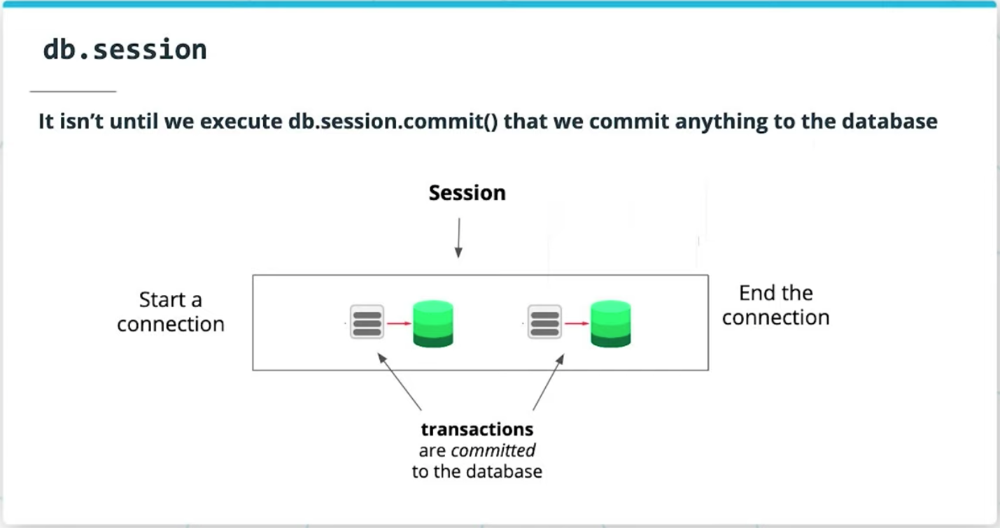
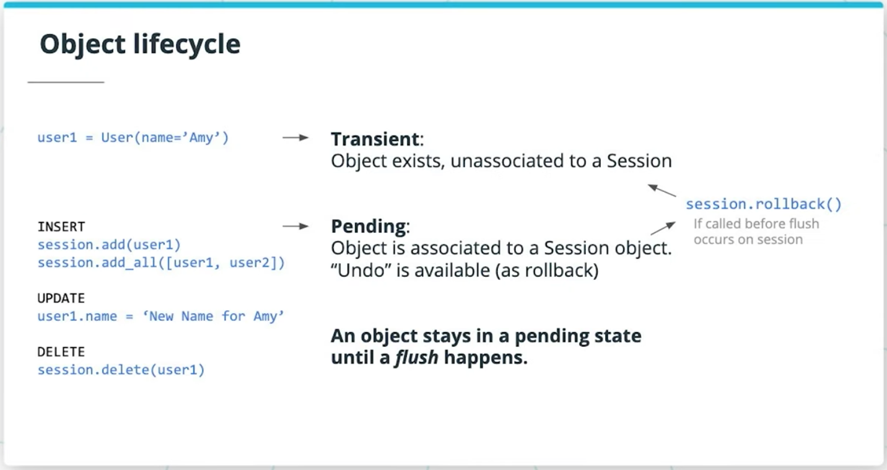
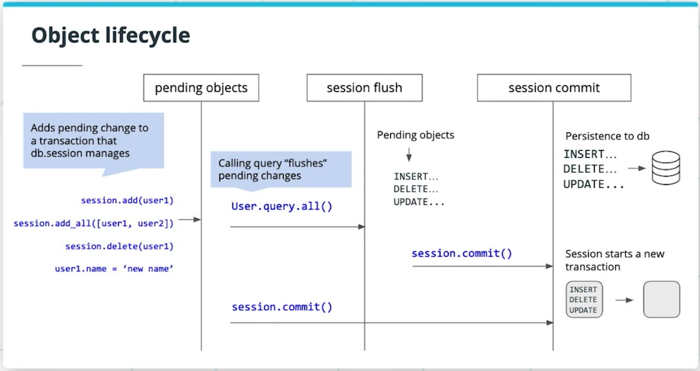

# Lesson 2-4. SQLAlchemy ORM in Depth

## `Model.query`

`db.Model.query` offers us the Query object.

- The Query object lets us generate `SELECT` statements that let us query and return slices of data from our database.
- Query has method chaining. You can chain one query method to another (indefinitely), getting back more query objects, until you chain it with a terminal method that returns a non-query object like `count()`, `all()`, `first()`, `delete()`, etc.
- The Query object can be accessed on a model using either:
  - `MyModel.query` directly on the model, or
  - `db.session.query(MyModel)` using `db.session.query` instead.

### Query Methods

#### Select records

**all**:

```python
MyModel.query.all()
```

- same as doing a `SELECT *`, fetching all records from the model's table. Returns a list of objects.

**first**:

```python
MyModel.query.first()
```

- Fetches just the first result. Returns either `None` or an object if found.

**filter_by**:

```python
MyModel.query.filter_by(my_table_attribute='some value')
```

- Similar to doing a `SELECT * from ... WHERE SQL statement` for filtering data by named attributes.

**filter**:

```python
MyModel.query.filter(MyOtherModel.some_attr='some value')
OrderItem.query.filter(Product.id=3)
```

- Similar to `filter_by`, but instead, you specify attributes on a given Model. It is more flexible than using `filter_by` itself, and *is especially useful when querying from a joined table* where you want to filter by attributes that span across multiple models.

More read: [Common Filter Operators](https://docs.sqlalchemy.org/en/13/orm/tutorial.html#common-filter-operators)

#### Ordering

**order_by**:

```python
MyModel.order_by(MyModel.created_at)
MyModel.order_by(db.desc(MyModel.created_at))
```

- To order the results by a given attribute. Use `db.desc` to order in descending order.

**limit**:

```python
Order.query.limit(100).all()
```

`limit(max_num_rows)` limits the number of returned records from the query. ala `LIMIT` in `SQL`.

#### Aggregates

**count**:

```python
query = Task.query.filter(completed=True)
query.count()
```

- Returns an integer set to the number of records that would have been returned by running the query.

**get**:

```python
model_id = 3
MyModel.query.get(model_id)
```

- Returns the object as a result of querying the model by its primary key.

#### Bulk Deletes

```python
query = Task.query.filter_by(category='Archived')
query.delete()
```

- `delete()` does a bulk delete operation that deletes every record matching the given query.

#### Joined Queries

```python
Driver.query.join('vehicles')
```

- Query has a method join(`<table_name>`) for joining one model to another table.

More Read: [Docs for the SQLAlchemy Query API](https://docs.sqlalchemy.org/en/13/orm/query.html)

## SQLAlchemy Object Lifecycle



### Takeaways

Within a session, we create transactions every time we want to commit work to the database. *Proposed changes are not immediately committed to the database* and instead go through stages to allow for undos. The ability to undo is allowed via `db.session.rollback()`.

### Stages



#### 1. Transient

```python
user1 = User(name='Amy')
```

An object exists, it was defined, but not attached to a session (yet).

#### 2. Pending

An object was attached to a session. "Undo" becomes available via `db.session.rollback()`. Waits for a flush to happen.

#### 3. Flushed


About ready to be committed to the database, translating actions into SQL command statements for the engine. It occurs:

- when you call `Query.` Or
- on `db.session.commit()`

#### 4. Committed



Manually called for a change to persist to the database (permanently). Session's transaction is cleared for a new set of changes.
