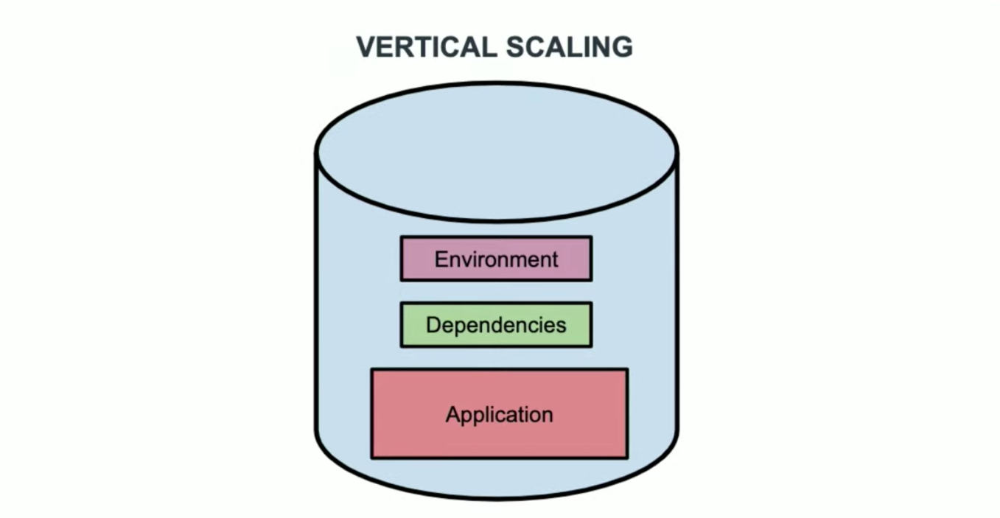

# Lesson 5-3. Deployment

## Lesson Overview

To manage scaling - spinning up new container instances and shutting them down as they are no longer needed - you will use a container orchestration service. There are several options for container orchestration, and in this course we will focus on [Kubernetes](https://kubernetes.io/).

To round out the production pipeline of your application, you will also learn about some tools to automate the process of building, testing, and deploying your code when you make changes. Automatically building and testing your code when changes are made is called [continuous integration](https://en.wikipedia.org/wiki/Continuous_integration). Continuous integration combined with automated deployment is referred to as [continous delivery](https://en.wikipedia.org/wiki/Continuous_delivery).

In this lesson, you will:

- Learn how to deploy a containerized app using AWS' Kubernetes service: [EKS](https://aws.amazon.com/eks/).
- Create a continuous delivery pipeline with [AWS CodePipeline](https://aws.amazon.com/codepipeline/).
- Set up continuous integration with [AWS CodeBuild](https://aws.amazon.com/codebuild/).

## Kubernetes

| Vertical Scaling | Horizontal Scaling |
|---|---|
|  |  |

Running an application in a single container alone doesn’t leverage the full power of containerization. One of the major strengths of using containers is the ease of scaling the count of container instances up and down to meet demands, known as *horizontal scaling*.

Orchestration platforms automate the deployment and scaling of multiple containers. [Kubernetes](https://kubernetes.io/) is one of the most popular platforms of this type, and the platform you will be using.

### Concepts


- *Cluster*: A group of machines running Kubernetes
- *Master*: The system which controls a Kubernetes cluster. You will typically interact with the master when you communicate with a cluster. The master includes an api, scheduler, and management daemon.
- *Nodes*: The machines in a cluster. These can be virtual, physical, or a combination of both.
- *Pods*: A deployment of an application. This consists of a container, it’s storage resources, and a unique IP address. Pods are not persistent, and may be brought up and down by the master during scaling.


In order to have a persistent way to communicate with ephemeral pods, a higher-level service abstraction is provided. Additionally, in order to have a persistent way to store data, volumes can be attached to pods.

- *Service*: An abstraction for communicating with a set of pods

**Further Research**:

- [General Kubernetes documentation](https://kubernetes.io/docs/home/)
- [Kubernetes volumes documentation](https://kubernetes.io/docs/concepts/storage/volumes/)

## Amazon Elastic Kubernetes Service (EKS)

- A managed Kubernetes service
- Control layer runs the master system
- Secure networks are set up automatically
- You only setup Nodes, Pods, and Services

**Further Research**:

- [What is EKS?](https://docs.aws.amazon.com/eks/latest/userguide/what-is-eks.html)

## AWS Command Line Tool - `AWSCLI`

### Install AWSCLI

There are multiple ways to install [AWSCLI](https://aws.amazon.com/cli/) based on your OS and the mode of installation. To install in a python virtual environment run

```bash
pip install awscli --upgrade
which aws
aws --version
```

For other environments see installation instructions [here](https://docs.aws.amazon.com/cli/latest/userguide/install-cliv1.html).

### Add IAM User - AWS Console


- Sign in to AWS Management Console as a `root`.
- Choose Identity and Access Management (IAM) service console. Go to *Users* section.
- If you haven’t already, add a new user. To keep it simple, note that the newly created user would need an `AdministratorAccess` permission in order to create a cluster.

### Setup AWSCLI with the IAM Credentials

- Go to AWS console, generate Access key ID and Secret access key for an existing IAM User. **You must save the keys locally.**
- On your terminal, run `aws configure list`. It will show you the values as not set.
- Run `aws configure --profile default`. It will prompt you for Access key ID, Secret access key, and Default region name.
- Check that your profile is set, using `aws configure list`.
- For troubleshooting, have a look at the documentation [here](https://docs.aws.amazon.com/cli/latest/userguide/cli-chap-configure.html).

### Create IAM Role - Command Line
