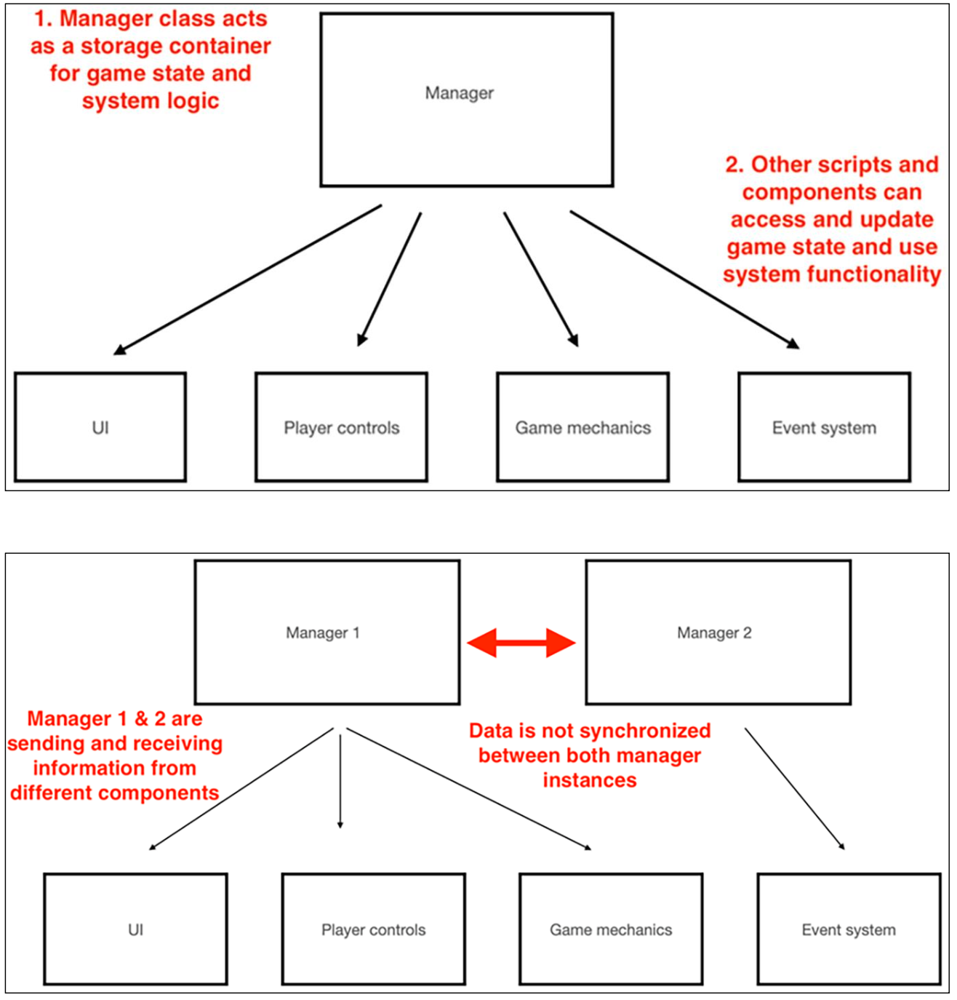
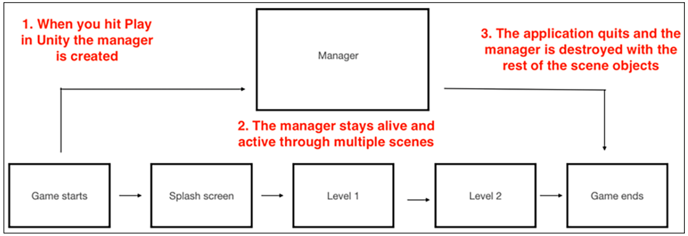
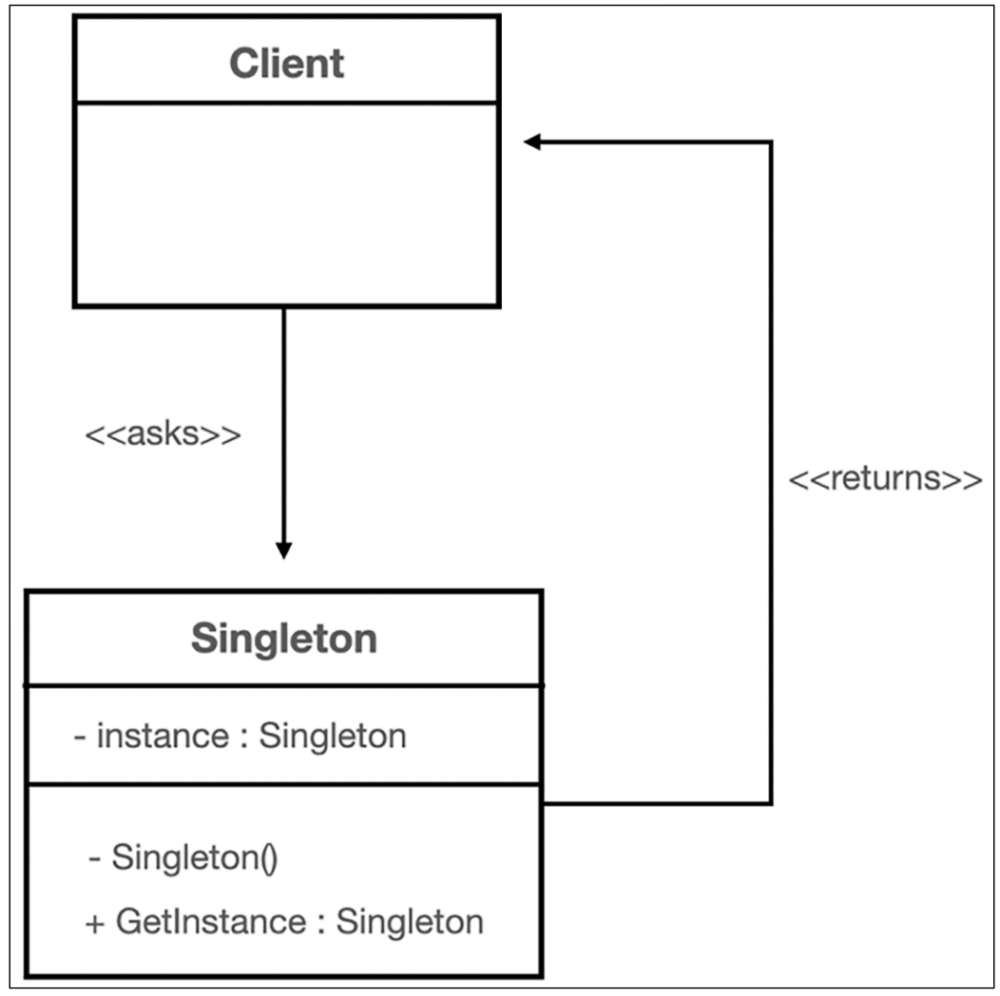
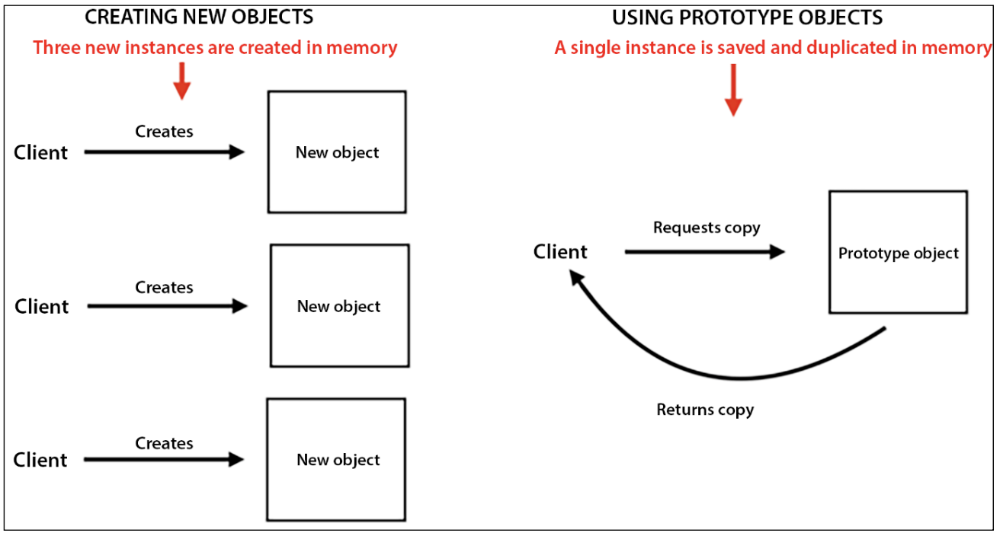
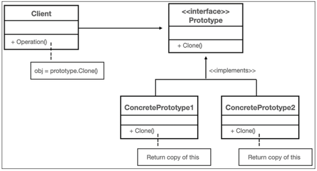
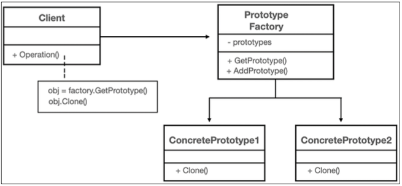
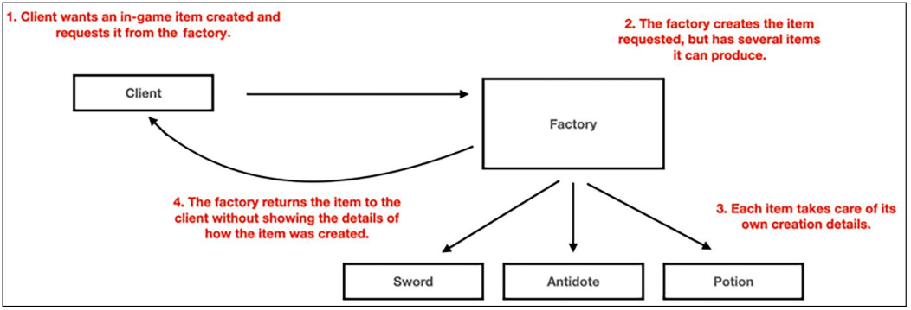
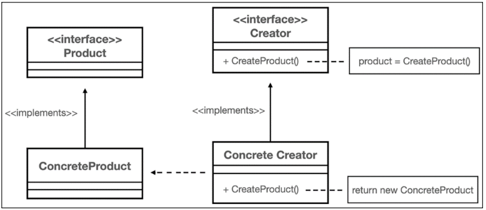

# Learning Design Patterns with Unity

- [GitHub Repo](https://github.com/PacktPublishing/C-Design-Patterns-with-Unity-First-Edition)

## Ch 01. Priming the System

Architectural patterns deal with problems affecting the overall structure you’re building, while design patterns focus on the individual LEGO blocks that make up the final structure.

A codebase that is flexible, maintainable, and reusable is the product of good software design.

### What are design patterns?

Design patterns are systems, and systems are designed to solve specific problems.

There are three categories that all original design patterns fall into – *Creational*, *Behavioral*, and *Structural*.

- First, knowing what problems each pattern category addresses is super important because it narrows the field you have to search.
- Second, reading the first few pages of each chapter in the applicable category will show you pretty quickly if you’re in the right place.
- From there, the more you use design patterns, the more you’ll get a feel for the problems and effective solutions out in the wild.

#### Creational patterns

Creational patterns deal with creating objects that are uniquely suited to a given situation or use case. More specifically, these patterns deal with how to hide object and class creation logic, so the calling instance doesn’t get bogged down with the details.

A good creational pattern black-boxes the creation logic and simply hands back a utility tool to control what, who, how, and when an object or class is created.

- **Singleton**: Ensure a class has only one instance and provide a global point of access to it – commonly used for features like logging or database connections that need to be coordinated and shared through the entire application.
- **Prototype**: Specify the kinds of objects to create using a prototypical instance and create new objects from the “skeleton” of an existing object.
- **Factory Method**: Define an interface for creating a single object, but delegate the instantiation logic to subclasses that decide which class to instantiate.
- **Abstract Factory**: Define an interface for creating families of related or dependent objects, but let subclasses decide which class to instantiate.
- **Builder**: Allows complex objects to be built step by step, separating an object’s construction from its representation – commonly used when creating different versions of an object.
- **Object Pool**: Avoid expensive acquisition and release of resources by recycling objects that are no longer in use – commonly used when resources are expensive, plentiful, or both.

#### Behavioral patterns

Behavioral patterns are concerned with how classes and objects communicate with each other. More specifically, these patterns concentrate on the different responsibilities and connections objects have with each other when they’re working together.

- **Command**: Encapsulate a request as an object, thereby allowing for the parameterization of clients with different requests and the queuing or logging of requests.
- **Observer**: Define a one-to-many dependency between objects where a state change in one object results in all its dependents being notified and updated automatically.
- **State**: Allow an object to alter its behavior when its internal state changes. The object will appear to change its class – commonly used when object behavior drastically changes depending on its internal state.
- **Visitor**: Define a new class operation without changing the underlying object.
- **Strategy**: Define a family of interchangeable behaviors and defer setting the behavior until runtime.
- **Type Object**: Allow the flexible creation of new “classes” from a single class, each instance of which will represent a different type of object.
- **Memento**: Capture and externalize the internal state of an object so it can be restored or reverted to this state later – without breaking encapsulation.

#### Structural patterns

Structural patterns focus on composition, or how classes and objects are composed into larger, more complex structures.

- **Decorator**: Attach additional responsibilities to an object dynamically keeping the same interface.
- **Adapter**: Convert the interface of a class into another interface clients expect. An adapter lets classes work together that could not otherwise because of incompatible interfaces.
- **Façade**: Provide a unified interface to a set of interfaces in a subsystem. Facade defines a high-level interface that makes the subsystem easier to use.
- **Flyweight**: Shares common data between similar objects to limit memory usage and increase performance.
- **Service Locator**: Provide a global access point for services without coupling client code to the concrete service classes.

## Ch 02. Managing Access with the Singleton Pattern

First, it’s important to recognize scenarios where the Singleton pattern is useful and doesn’t just add unnecessary complexity to your code. The original Gang of Four text says you should consider using the Singleton pattern when:

> You need to limit a class to a single instance and have that unique instance be accessible to clients through a global access point.

A global variable can take care of the accessibility, and in the case of `C#`, a static variable fits the bill nicely. When you put it all together, a singleton class is responsible for initializing, storing, and returning its own unique instance, as well as protecting against duplicate instance requests.

In Unity, there are two additional features to a singleton class:

- First, the singleton is responsible for destroying any GameObject with a duplicate singleton class script component.
- Second, the singleton is responsible for keeping itself active through the full application lifecycle.

> UML Diagram: Singleton pattern

### Pros & Cons of Singleton pattern

Pros:

- It saves resources by only initializing itself when first asked, which means we won’t have an unused singleton taking up our valuable memory.
- It is initialized at runtime and has access to information only available after the game is running.

Cons:

- Increased coupling between classes is generally not a good outcome in programming.
- Unit testing can become very difficult when dependencies are everywhere.

Either:

- Global access is a double-edged sword.
- Global state doesn’t play well with concurrency.

### Singleton Pattern Summary

Keep in mind that your singleton classes are most useful when you only want a single class instance, a global point of access, and persistence throughout the Unity game lifecycle. You have the choice of lazily instantiating your singleton objects, which helps with accessing information your project may only have after compiling (not to mention the singleton itself won’t be created until it’s needed). You can also go for a generic solution, which can be a subclass or even a `ScriptableObject`!

However, it’s important to remember that any globally accessible objects can have adverse effects if you’re not careful. They can lead to increased coupling between classes, difficulty tracking down global state bugs, and inefficient unit testing. Globally accessible state is also not thread-safe, but we’ve covered how to add thread-locking code to your singleton to address threading issues.

## Ch 03. Spawning Enemies with the Prototype Pattern

As part of the creational family of design patterns, the Prototype pattern gives us control over how we make copies of common base objects, making it effective when:

- A system needs to be independent of how its objects are created, composed, and represented.
- The objects you’re creating need to be specified at runtime.
- You want to avoid parallel class hierarchies of factories and objects.
- You want to specify the kind of objects you’re creating by defining a prototypical instance and copying it.

The Prototype pattern has three main components:

- **The Prototype** interface, enabling objects to copy themselves
- **The Concrete Prototypes** that implement the self-cloning logic
- **The Client**, which creates new objects by asking prototypes for clones of themselves

We’ll also be using an optional variation called a **Prototype Factory** class, which stores a single instance of each prototypical object we want to clone.

### Pros & Cons of Prototype pattern

Pros:

- Bulit-in initialization overhead and memory management
- Easy adding and removing of new prototypical objects at runtime
- Ability to create new objects with different values and structures from the same prototypical objects
- Safer self-duplication

Cons:

- Be mindful of the internal structures of your prototypical objects
- Destroying the prototypical object instance before making a copy will not increase your memory efficiency. This type of workflow is common when using the Prototype pattern with **Object Pooling** and can lead to unwanted race conditions.

## Ch 04. Creating Items with the Factory Method Pattern

In this chapter, we’ll learn how the Factory Method pattern not only lets you specify a common interface for any objects you’re creating but also lets the subclass decide the actual class being instantiated.

Before we dive in any further, we should talk about two design patterns related to factories: the **Factory Method** and **Abstract Factory patterns**. The Factory Method pattern allows you to make objects without specifying the exact class being instantiated, while the Abstract Factory pattern combines groups of related factories without specifying the concrete factory classes that are rolling out the items.

How to choose between these two patterns is a question of categories and scale (and you should absolutely ask yourself these questions). How many kinds of items do you need? Can they be grouped into families of related products? Will composition work better than inheritance for your scenario, or vice versa?

In this chapter, we’ll focus on using a factory with a small variety of items to:

- Create a product interface and concrete products
- Build different creator class and factory method variations
- Scale factories with reflection and LINQ
- Integrate Unity prefabs in to product and creator classes

### Breaking down the Factory Method pattern

The Factory Method pattern gives us the power to create objects through an interface without having to specify the exact class that’s getting instantiated. The Factory Method pattern is useful when:

- Your class can’t specify the class objects it’s required to create.
- Your class needs its subclasses to determine the objects it’s required to create.
- You need a common method or operation among all objects for instantiation.

The main takeaway for this pattern is deferment – we can have as many different objects as we want, but if they all implement the common interface, we can treat them the same in our client code. This is extremely useful when you’re creating more complex objects, especially in games, where you want the actual instantiation logic hidden in a black box with only the common methods exposed (those common methods are called the factory methods, which is where the pattern gets its name from).

### Diagramming the Factory Method pattern

Figure shows the structure of the Factory Method pattern, which has four components:

- **The Product interface** for all objects our factory method can create.
- **Concrete Products** that implement the Product interface.
- **An abstract Creator class**, which declares the factory method and returns a Product object. This class can also provide default factory method logic that returns a default Product object.
- **A Concrete Creator class** that subclasses the Creator and overrides the factory method to return specific Concrete Product instances.

In cases where a parallel class hierarchy would create too much overhead every time a new product is added to the game, it’s useful to understand the different variations of the Factory Method pattern:

- A Concrete Creator class can be declared without a parent class and simply have default factory methods for each of its products. *This is only scalable and flexible if there is a set number of products or product tiers.*
- A Concrete Creator class can be declared with a factory method that takes in an argument specifying the product you want to be returned. *This is the most common variation, but it can quickly get out of hand when scaling products.* We’ll talk more about maximizing scalability and efficient maintenance with reflection in the Scaling factories with reflection and LINQ section.

### Pros & Cons of Factory Method pattern

Pros:

- No more binding specific classes in your client code; everything goes through the Product interface. Adding new products is as easy as implementing the Product interface.
- Black-boxing object creation into product subclasses keeps everything together but hidden. This is especially flexible and scalable when you’re creating complex objects and need to expand a factory’s duties.

Cons:

- Extra code means extra time spent handling your product and factory relationships, which is why we’ll spend considerable time in this chapter talking about the three variations this pattern offers to remove some of that extra abstraction overhead. Choosing the right type of product-to-factory relationship is essential to making this pattern work for you.
- The Factory Method isn’t the Abstract Factory – these are different patterns, and they have different implementations, pros, and pitfalls. The Factory Method lets you make objects without specifying the class being instantiated, while the Abstract Factory pattern combines groups of related factories without specifying concrete factory classes. Ask yourself what the end goal is and then choose between the two patterns rather than trying to create a Frankenstein’s monster of both.

### Working with different factory class variations

There are three variations of factory classes in the Factory pattern:

- The common Abstract/Concrete parallel factory structure
- The Concrete-only factory structure
- The Parameterized factory

#### Abstract/Concrete parallel factory structure

A parallel class hierarchy between products and factories doesn’t necessarily scale well, but it’s effective when you have a preset number of products in your game that aren’t likely to change.

#### Concrete-only factory structure

The concrete factory class variation lets you declare factory methods with default implementations, while still being able to override them in subclasses if necessary. The concrete parent factory is also a good choice when you have a set way of creating products.

A classic example is programmatically creating a maze with set products like walls, rooms, and doors in a static configuration but with interchangeable products.

#### Parameterized factory

What if our game needs factories that can build a growing set of products? Luckily, there’s a variation of the factory pattern called a parameterized factory, where we store products by key and simply request the item we want.

#### Scaling factories with reflection and LINQ

Using a parameterized factory class can quickly become a spaghetti nightmare of monstrous switch statements and unmanageable code if items are being added or updated at a fast pace.

Luckily, C# has a System.Reflection namespace that can tell you about all the classes, interfaces, and value types your project has by looking through the project’s assembly. In addition to reflection, we’ll be using the LINQ API, which stands for Language Integrated Query.
