# Learning Design Patterns with Unity

- [GitHub Repo](https://github.com/PacktPublishing/C-Design-Patterns-with-Unity-First-Edition)

## Ch 01. Priming the System

Architectural patterns deal with problems affecting the overall structure you’re building, while design patterns focus on the individual LEGO blocks that make up the final structure.

A codebase that is flexible, maintainable, and reusable is the product of good software design.

### What are design patterns?

Design patterns are systems, and systems are designed to solve specific problems.

There are three categories that all original design patterns fall into – *Creational*, *Behavioral*, and *Structural*.

- First, knowing what problems each pattern category addresses is super important because it narrows the field you have to search.
- Second, reading the first few pages of each chapter in the applicable category will show you pretty quickly if you’re in the right place.
- From there, the more you use design patterns, the more you’ll get a feel for the problems and effective solutions out in the wild.

#### Creational patterns

Creational patterns deal with creating objects that are uniquely suited to a given situation or use case. More specifically, these patterns deal with how to hide object and class creation logic, so the calling instance doesn’t get bogged down with the details.

A good creational pattern black-boxes the creation logic and simply hands back a utility tool to control what, who, how, and when an object or class is created.

- **Singleton**: Ensure a class has only one instance and provide a global point of access to it – commonly used for features like logging or database connections that need to be coordinated and shared through the entire application.
- **Prototype**: Specify the kinds of objects to create using a prototypical instance and create new objects from the “skeleton” of an existing object.
- **Factory Method**: Define an interface for creating a single object, but delegate the instantiation logic to subclasses that decide which class to instantiate.
- **Abstract Factory**: Define an interface for creating families of related or dependent objects, but let subclasses decide which class to instantiate.
- **Builder**: Allows complex objects to be built step by step, separating an object’s construction from its representation – commonly used when creating different versions of an object.
- **Object Pool**: Avoid expensive acquisition and release of resources by recycling objects that are no longer in use – commonly used when resources are expensive, plentiful, or both.

#### Behavioral patterns

Behavioral patterns are concerned with how classes and objects communicate with each other. More specifically, these patterns concentrate on the different responsibilities and connections objects have with each other when they’re working together.

- **Command**: Encapsulate a request as an object, thereby allowing for the parameterization of clients with different requests and the queuing or logging of requests.
- **Observer**: Define a one-to-many dependency between objects where a state change in one object results in all its dependents being notified and updated automatically.
- **State**: Allow an object to alter its behavior when its internal state changes. The object will appear to change its class – commonly used when object behavior drastically changes depending on its internal state.
- **Visitor**: Define a new class operation without changing the underlying object.
- **Strategy**: Define a family of interchangeable behaviors and defer setting the behavior until runtime.
- **Type Object**: Allow the flexible creation of new “classes” from a single class, each instance of which will represent a different type of object.
- **Memento**: Capture and externalize the internal state of an object so it can be restored or reverted to this state later – without breaking encapsulation.

#### Structural patterns

Structural patterns focus on composition, or how classes and objects are composed into larger, more complex structures.

- **Decorator**: Attach additional responsibilities to an object dynamically keeping the same interface.
- **Adapter**: Convert the interface of a class into another interface clients expect. An adapter lets classes work together that could not otherwise because of incompatible interfaces.
- **Façade**: Provide a unified interface to a set of interfaces in a subsystem. Facade defines a high-level interface that makes the subsystem easier to use.
- **Flyweight**: Shares common data between similar objects to limit memory usage and increase performance.
- **Service Locator**: Provide a global access point for services without coupling client code to the concrete service classes.

## Ch 02. Managing Access with the Singleton Pattern

First, it’s important to recognize scenarios where the Singleton pattern is useful and doesn’t just add unnecessary complexity to your code. The original Gang of Four text says you should consider using the Singleton pattern when:

> You need to limit a class to a single instance and have that unique instance be accessible to clients through a global access point.

A global variable can take care of the accessibility, and in the case of `C#`, a static variable fits the bill nicely. When you put it all together, a singleton class is responsible for initializing, storing, and returning its own unique instance, as well as protecting against duplicate instance requests.

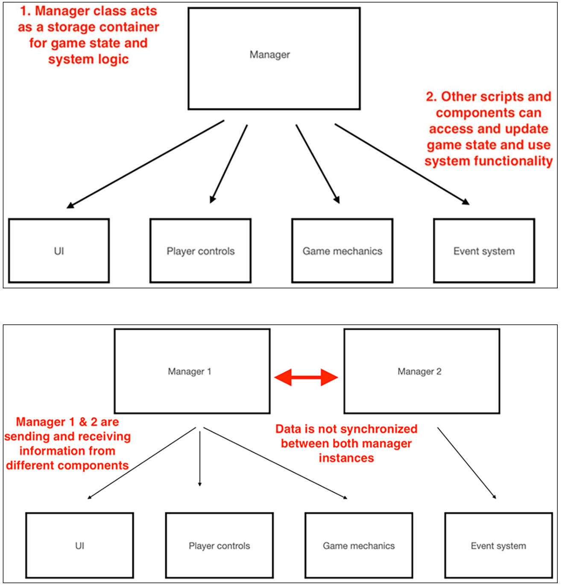

In Unity, there are two additional features to a singleton class:

- First, the singleton is responsible for destroying any GameObject with a duplicate singleton class script component.
- Second, the singleton is responsible for keeping itself active through the full application lifecycle.

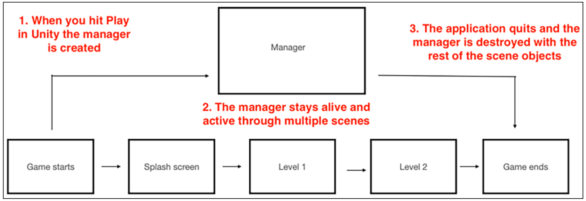

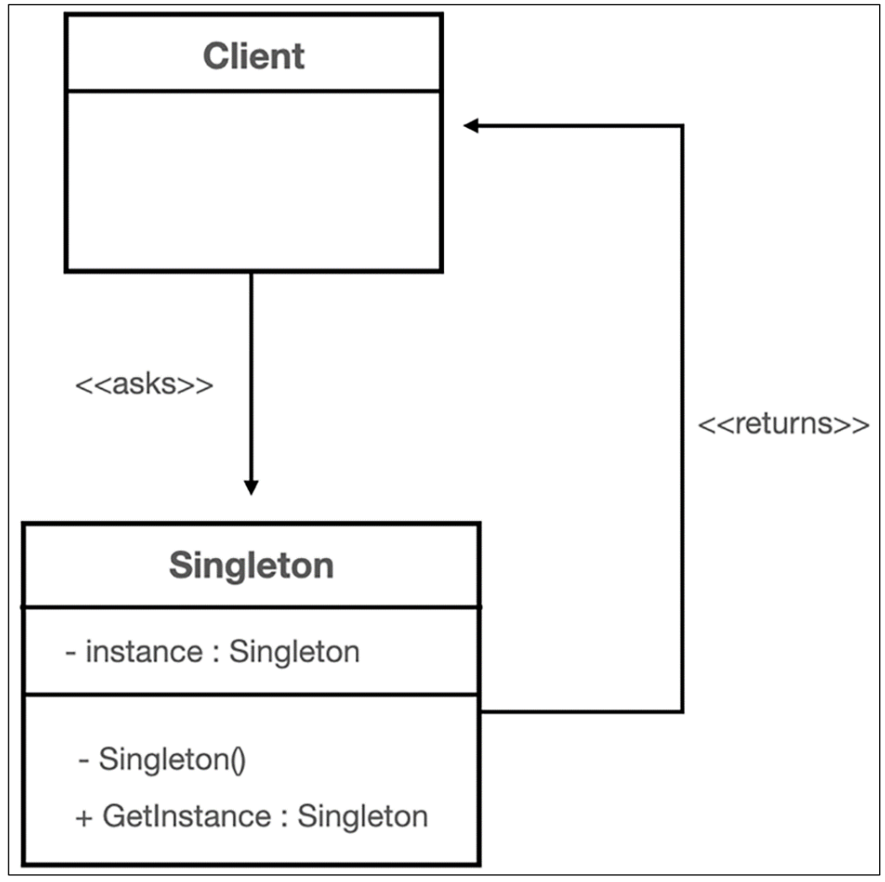
> UML Diagram: Singleton pattern

### Pros & Cons of Singleton pattern

Pros:

- It saves resources by only initializing itself when first asked, which means we won’t have an unused singleton taking up our valuable memory.
- It is initialized at runtime and has access to information only available after the game is running.

Cons:

- Increased coupling between classes is generally not a good outcome in programming.
- Unit testing can become very difficult when dependencies are everywhere.

Either:

- Global access is a double-edged sword.
- Global state doesn’t play well with concurrency.

### Singleton Pattern Summary

Keep in mind that your singleton classes are most useful when you only want a single class instance, a global point of access, and persistence throughout the Unity game lifecycle. You have the choice of lazily instantiating your singleton objects, which helps with accessing information your project may only have after compiling (not to mention the singleton itself won’t be created until it’s needed). You can also go for a generic solution, which can be a subclass or even a `ScriptableObject`!

However, it’s important to remember that any globally accessible objects can have adverse effects if you’re not careful. They can lead to increased coupling between classes, difficulty tracking down global state bugs, and inefficient unit testing. Globally accessible state is also not thread-safe, but we’ve covered how to add thread-locking code to your singleton to address threading issues.

## Ch 03. Spawning Enemies with the Prototype Pattern

As part of the creational family of design patterns, the Prototype pattern gives us control over how we make copies of common base objects, making it effective when:

- A system needs to be independent of how its objects are created, composed, and represented.
- The objects you’re creating need to be specified at runtime.
- You want to avoid parallel class hierarchies of factories and objects.
- You want to specify the kind of objects you’re creating by defining a prototypical instance and copying it.

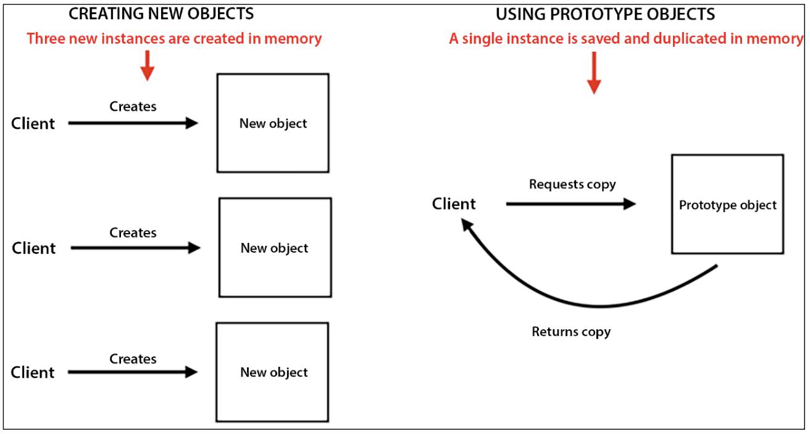

The Prototype pattern has three main components:

- **The Prototype** interface, enabling objects to copy themselves
- **The Concrete Prototypes** that implement the self-cloning logic
- **The Client**, which creates new objects by asking prototypes for clones of themselves

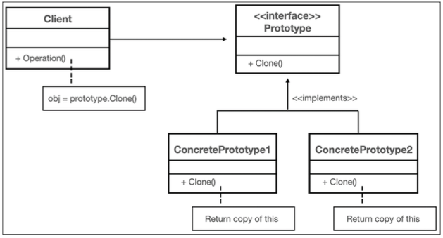

We’ll also be using an optional variation called a **Prototype Factory** class, which stores a single instance of each prototypical object we want to clone.

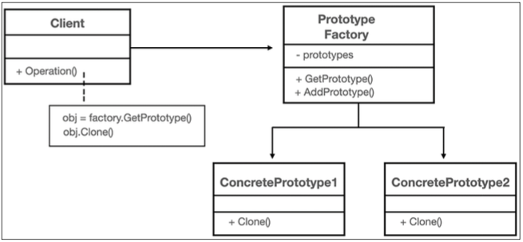

### Pros & Cons of Prototype pattern

Pros:

- Bulit-in initialization overhead and memory management
- Easy adding and removing of new prototypical objects at runtime
- Ability to create new objects with different values and structures from the same prototypical objects
- Safer self-duplication

Cons:

- Be mindful of the internal structures of your prototypical objects
- Destroying the prototypical object instance before making a copy will not increase your memory efficiency. This type of workflow is common when using the Prototype pattern with **Object Pooling** and can lead to unwanted race conditions.

## Ch 04. Creating Items with the Factory Method Pattern

In this chapter, we’ll learn how the Factory Method pattern not only lets you specify a common interface for any objects you’re creating but also lets the subclass decide the actual class being instantiated.

Before we dive in any further, we should talk about two design patterns related to factories: the **Factory Method** and **Abstract Factory patterns**. The Factory Method pattern allows you to make objects without specifying the exact class being instantiated, while the Abstract Factory pattern combines groups of related factories without specifying the concrete factory classes that are rolling out the items.

How to choose between these two patterns is a question of categories and scale (and you should absolutely ask yourself these questions). How many kinds of items do you need? Can they be grouped into families of related products? Will composition work better than inheritance for your scenario, or vice versa?

In this chapter, we’ll focus on using a factory with a small variety of items to:

- Create a product interface and concrete products
- Build different creator class and factory method variations
- Scale factories with reflection and LINQ
- Integrate Unity prefabs in to product and creator classes

### Breaking down the Factory Method pattern

The Factory Method pattern gives us the power to create objects through an interface without having to specify the exact class that’s getting instantiated. The Factory Method pattern is useful when:

- Your class can’t specify the class objects it’s required to create.
- Your class needs its subclasses to determine the objects it’s required to create.
- You need a common method or operation among all objects for instantiation.

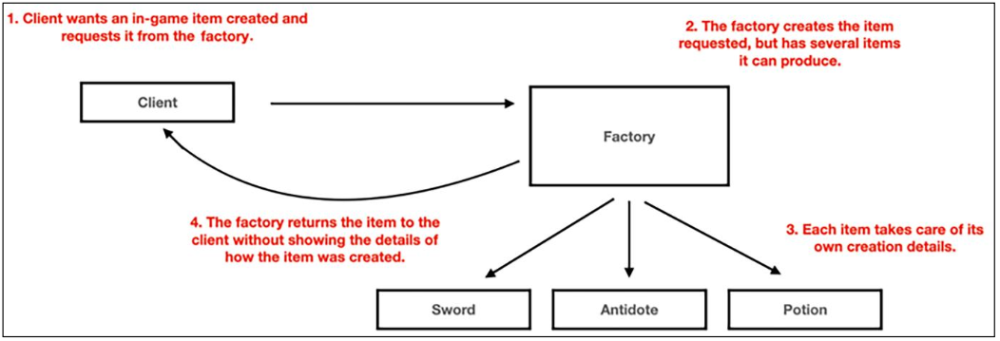

The main takeaway for this pattern is deferment – we can have as many different objects as we want, but if they all implement the common interface, we can treat them the same in our client code. This is extremely useful when you’re creating more complex objects, especially in games, where you want the actual instantiation logic hidden in a black box with only the common methods exposed (those common methods are called the factory methods, which is where the pattern gets its name from).

### Diagramming the Factory Method pattern

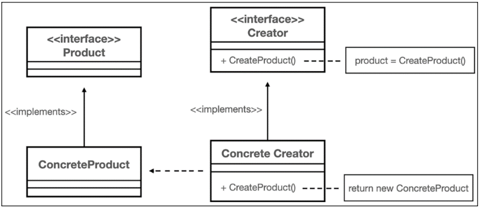

Figure shows the structure of the Factory Method pattern, which has four components:

- **The Product interface** for all objects our factory method can create.
- **Concrete Products** that implement the Product interface.
- **An abstract Creator class**, which declares the factory method and returns a Product object. This class can also provide default factory method logic that returns a default Product object.
- **A Concrete Creator class** that subclasses the Creator and overrides the factory method to return specific Concrete Product instances.

In cases where a parallel class hierarchy would create too much overhead every time a new product is added to the game, it’s useful to understand the different variations of the Factory Method pattern:

- A Concrete Creator class can be declared without a parent class and simply have default factory methods for each of its products. *This is only scalable and flexible if there is a set number of products or product tiers.*
- A Concrete Creator class can be declared with a factory method that takes in an argument specifying the product you want to be returned. *This is the most common variation, but it can quickly get out of hand when scaling products.* We’ll talk more about maximizing scalability and efficient maintenance with reflection in the Scaling factories with reflection and LINQ section.

### Pros & Cons of Factory Method pattern

Pros:

- No more binding specific classes in your client code; everything goes through the Product interface. Adding new products is as easy as implementing the Product interface.
- Black-boxing object creation into product subclasses keeps everything together but hidden. This is especially flexible and scalable when you’re creating complex objects and need to expand a factory’s duties.

Cons:

- Extra code means extra time spent handling your product and factory relationships, which is why we’ll spend considerable time in this chapter talking about the three variations this pattern offers to remove some of that extra abstraction overhead. Choosing the right type of product-to-factory relationship is essential to making this pattern work for you.
- The Factory Method isn’t the Abstract Factory – these are different patterns, and they have different implementations, pros, and pitfalls. The Factory Method lets you make objects without specifying the class being instantiated, while the Abstract Factory pattern combines groups of related factories without specifying concrete factory classes. Ask yourself what the end goal is and then choose between the two patterns rather than trying to create a Frankenstein’s monster of both.

### Working with different factory class variations

There are three variations of factory classes in the Factory pattern:

- The common Abstract/Concrete parallel factory structure
- The Concrete-only factory structure
- The Parameterized factory

#### Abstract/Concrete parallel factory structure

A parallel class hierarchy between products and factories doesn’t necessarily scale well, but it’s effective when you have a preset number of products in your game that aren’t likely to change.

#### Concrete-only factory structure

The concrete factory class variation lets you declare factory methods with default implementations, while still being able to override them in subclasses if necessary. The concrete parent factory is also a good choice when you have a set way of creating products.

A classic example is programmatically creating a maze with set products like walls, rooms, and doors in a static configuration but with interchangeable products.

#### Parameterized factory

What if our game needs factories that can build a growing set of products? Luckily, there’s a variation of the factory pattern called a parameterized factory, where we store products by key and simply request the item we want.

#### Scaling factories with reflection and LINQ

Using a parameterized factory class can quickly become a spaghetti nightmare of monstrous switch statements and unmanageable code if items are being added or updated at a fast pace.

Luckily, C# has a System.Reflection namespace that can tell you about all the classes, interfaces, and value types your project has by looking through the project’s assembly. In addition to reflection, we’ll be using the LINQ API, which stands for Language Integrated Query.

## Ch 05. Building a Crafting System with the Abstract Factory Pattern

### Breaking down the Abstract Factory pattern

The Abstract Factory pattern is all about using a common interface to create families of related or dependent products without knowing the concrete classes of the products being created. You’ll find this pattern is most useful in scenarios where:

- You need a product creation system that’s decoupled from how the products are created or assembled.
- Your creation system can be configured with a variety of product families.
- You need to explicitly constrain a family of related products designed to work together.
- You need a collection of products but only want the system to know about their interfaces instead of detailed implementation.

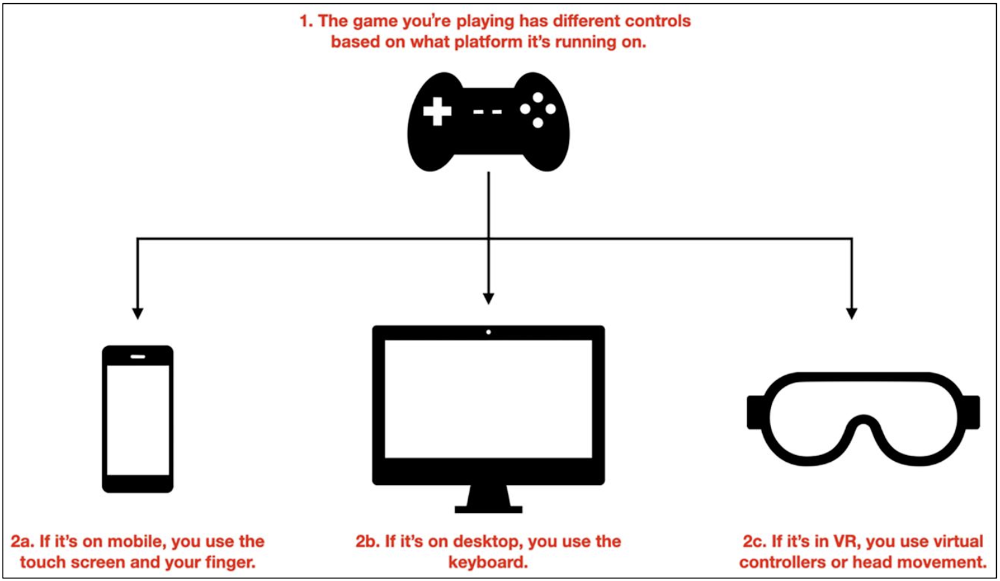
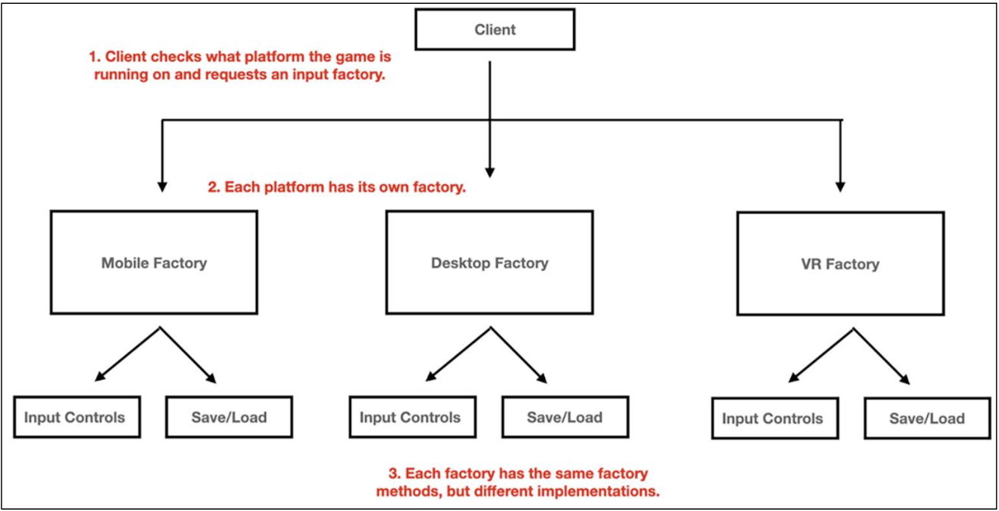

Like the Factory Method pattern, each product in this example implements a common interface (i.e., Input Controls and Save/Load, as you can see in the preceding figure), while each factory also implements a set of common interfaces for creating and interacting with those products. The main difference is that the Abstract Factory pattern handles families of related or dependent products with an added layer of abstraction.

### Diagramming the Abstract Factory pattern

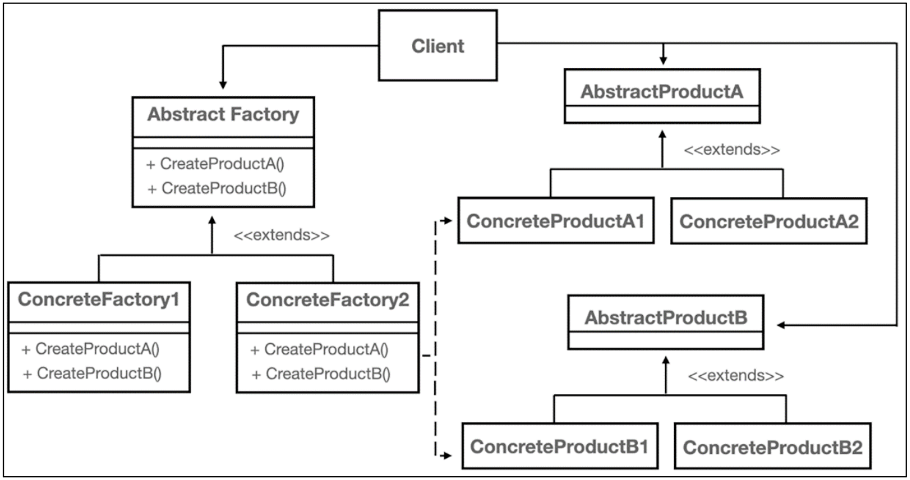

Figure 5.3 shows the UML structure for the Abstract Factory pattern and the interactions of its five component parts:

- The **Abstract Product** defines the interface for each type of product, related or dependent.
- Each **Concrete Product** implements the Abstract Product interface and defines a type of product that can be created by its corresponding Concrete Factory.
- The **Abstract Factory** defines an interface for creating abstract products.
- Each **Concrete Factory** implements the Abstract Factory interface and creates a designated family of products.
- The **Client** only works with the Abstract Factory and Abstract Product interfaces, hiding all implementation logic.

When you’re trying to choose which pattern fits your problem best (between the Factory Method and Abstract Factory choices), it’s important to remember the following:

- The **Factory Method** pattern encapsulates, or hides, the construction code for specific objects.
- The **Abstract Factory** pattern encapsulates the construction of groups of objects, usually referred to as object families. These objects are always related, but they can also be dependent on, and interact with, each other.

### Pros and Cons of the Abstract Factory Pattern

Pros:

- Concrete class creation is kept separate from your implementation code, meaning you can control the kinds of objects that are being instantiated in your project. This separation also means client code is never aware of the concrete product classes, only their exposed interfaces.
- Switching entire product families is easy – simply changing the Concrete Factory being used gives you an entirely new set of products to configure and spit out.
- Enforcing consistency between products in the same family is built-in – they can work together efficiently, and you can keep track of which products aren’t meant to be interacting by keeping them in separate product families.

Cons:

- Adding new products can be time consuming because Abstract Factory patterns usually have a fixed list of products they can create.
- The Abstract Factory isn’t the Factory Method – these are different patterns, and have different implementations, pros, and pitfalls.

## Ch 06. Assembling Support Characters with the Builder Pattern

In this chapter, we’ll work on assembling complex objects while separating the actual construction process from its representation.

While Prefabs are great for `static` objects, the Builder pattern really shines when you need an encapsulated construction process AND abstractions to handle individual objects and their component pieces.

### Breaking down the Builder pattern

As part of the Creational family of design patterns, the Builder pattern focuses on creating different representations of a complex object while delegating the customized building instructions to concrete builder classes. You’ll find this pattern is most useful in scenarios where:

- You need to separate the construction of complex objects from their representations.
- You want to build different objects using the same construction process.
- Finer control of each step of the construction process is necessary.
- You want to delegate creating the object to an encapsulated builder instead of directly creating them in the client.

The Builder pattern example that’s familiar to most people is the assembly line – in this case, a car factory.

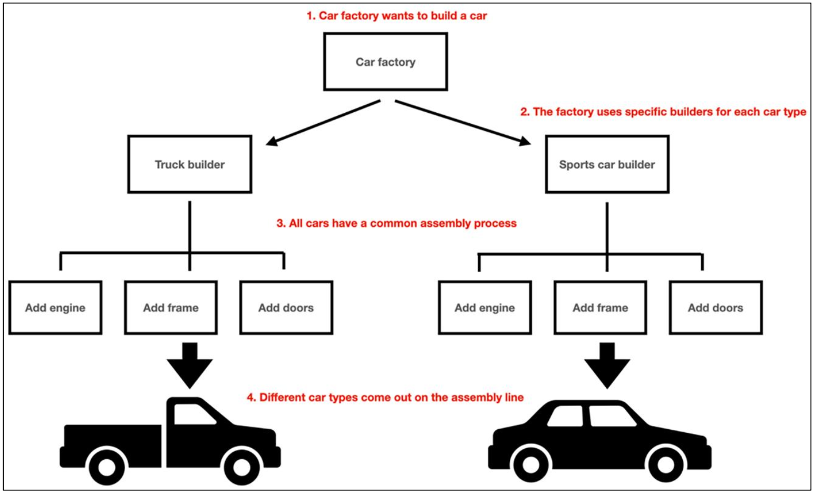

In a gaming scenario, your character might have a customizable character system where they can specify the hair, eyes, facial hair, and body type of their playable avatar, and the game saves them each time as a complex object. It doesn’t matter what character class, species, or type your player is building, only the way the character is put together. Orcs, humans, wizards, and elves all presumably need a head, eyes, and a body, all with optional facial hair on request.

Really, any situation where a larger complex object is composed of smaller component parts is a good candidate for the Builder pattern.

### Diagramming the Builder pattern

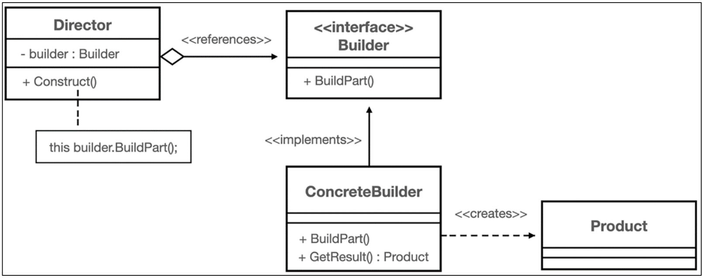

Figure 6.3 shows the UML structure of the basic Builder design pattern and the interaction of its four components:

- The **Director** initiates and manages all object creation using the builder interface methods, which removes any construction logic from the client.
- The `Builder` interface defines the common methods for building each part of the product.
- **Concrete Builders** (or Builders) are the corresponding builder classes for each different product representation.
- The `Product` is the base object created, which has a reference to all its component parts and can add new components.

### Pros and Cons of the Builder pattern

Pros:

- Construction is hidden from the client. The internal build process for each object, and the type of object being built, are both separated from the client code.
- A step-by-step construction process, which allows fine-grain control over how each part or component is built and added to the completed object.

Cons:

- New objects increase code complexity. Anytime you want to add a new object to the pattern, you’ll need to manually program how that object is put together.

#### Customizing object components

One of the main complaints about the Builder pattern is how hardcoded and static it can be, which begs the question of why we’re using it in the first place. This is especially true in Unity, as Prefabs are more UI-friendly to designers and programmers. However, that is only true if the Prefabs are themselves static and your scenarios only need to instantiate them. In those cases, the Prototype or Abstract Factory patterns would be a better fit.

However, when you need to create customizable objects made of different and interchangeable parts, the Builder pattern comes in as a strong contender. I would even argue the Builder pattern is more useful in Unity in these situations, as you can build component parts out of `ScriptableObjects` or Prefabs, configure them however you want, and then assemble them into complex objects in a scene. As for scaling and flexibility, you can easily add customization parameters to your IBuilder interface methods on a component-by-component basis.

## Ch 07. Managing Performance and Memory with Object Pooling

In this chapter, we’ll switch gears and focus on increasing performance and managing memory allocation when creating new objects with the Object Pool pattern. This approach is twofold; first, you get to control when batches of objects are instantiated, and second, you control how they are stored in a reusable pool that you can grab from whenever you want (without any additional CPU overhead).

### Breaking down the Object Pool pattern

Because the Object Pool pattern is about pooling shared objects rather than creating and destroying objects one at a time, you’ll find it most useful when:

- You have objects that are instantiated and destroyed at a high rate and/or are computationally expensive to instantiate (think about how many bullets a first-person shooter has to put onscreen when you’re really in the thick of it).
- You want to keep track of and control memory allocation when creating objects.
- You want to improve performance by allocating and reusing objects with a predictable memory footprint and timeframe.

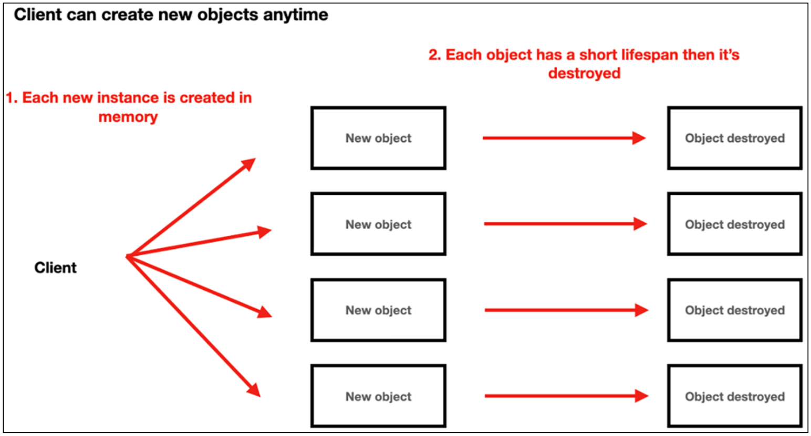

In a program, there’s no natural limit to how many times you can use the new keyword and create a new object instance. You won’t find out anything is wrong until you run your game and either a user’s hardware can’t take it and crashes or they stop playing because it’s so unbelievably slow.

Pay special attention to objects that come with resource dependencies like database connections or network sockets, which makes them costly to instantiate even once, let alone in multiples.

In all cases, creating new objects will produce a significant spike in CPU usage and garbage collection, resulting in slower frame rates and possible crashes. The solution is to create a set number of objects at the beginning of your program or script (or anywhere that it won’t negatively affect the CPU), then check out objects when requested and return them when they’re no longer needed, as shown in the following figure:

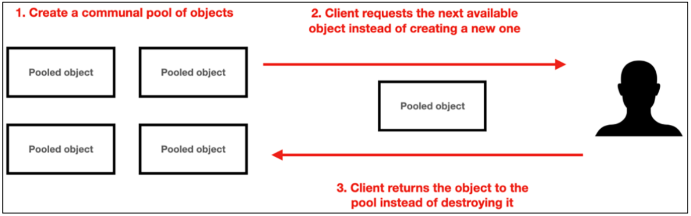

An Object Pool also naturally sets an upper limit on how many new objects can be created, forcing the client to wait for the next available object rather than creating new ones.

### Diagramming the Object Pool pattern

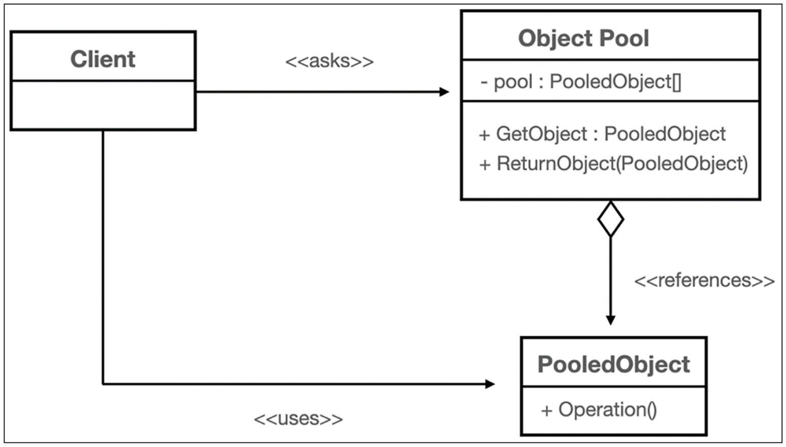

Figure 7.4 shows the UML structure of the basic Object Pool design pattern with its three components:

- The **Client** is only concerned with the `Object Pool`, asking for a reusable object anytime it needs one.
- The `Object Pool` then checks if one is available and returns it if there’s one free.
  - If the list of pooled objects is empty, or all of them are in use, the `Object Pool` can create and return a new one.
  - If all objects are in use, the client will need to wait for one to become available.
- The reusable `Pooled Object` class holds any object methods or interaction logic.

### Pros and Cons of the Object Pool pattern

Pros:

- **Performance boost** when the memory and resource cost of instantiating the object is pricey and the rate of creation (and destruction) is high.
- **Predictability** when object creation depends on resources that might take a varied length of time to access.

Cons:

- **Stale state** happens when you don’t reset your pooled objects when returning them to the communal pool.
- **Threading issues** can spring up if an Object Pool is being used by more than one thread, but this can be nipped in the bud by making the pool mechanics thread-safe.

## Ch 08. Binding Actions with the Command Pattern

In this chapter, we’ll dive into creating actionable requests that can be customized, queued, and undone with the Command pattern. When I say *actionable requests*, what we’re really talking about are commands that come pre-packaged with all the information they need to be executed. This way, when we need the requests to do their work, they already have everything they need to get their job done!

The Command pattern lets you create actions as objects, meaning you can customize them during instantiation, execute them immediately, store them for later, and even undo or redo them, which is useful when:

- You want to create actions as self-contained objects with all the information needed to execute the action.
- You want interchangeable actions that can work on any receiving object.
- You want to store or queue sequences of actions to be triggered later.
- You want to avoid hard-wiring requests to the client making the request.
- You want to support undo and redo functionality.

### Diagramming the Command pattern

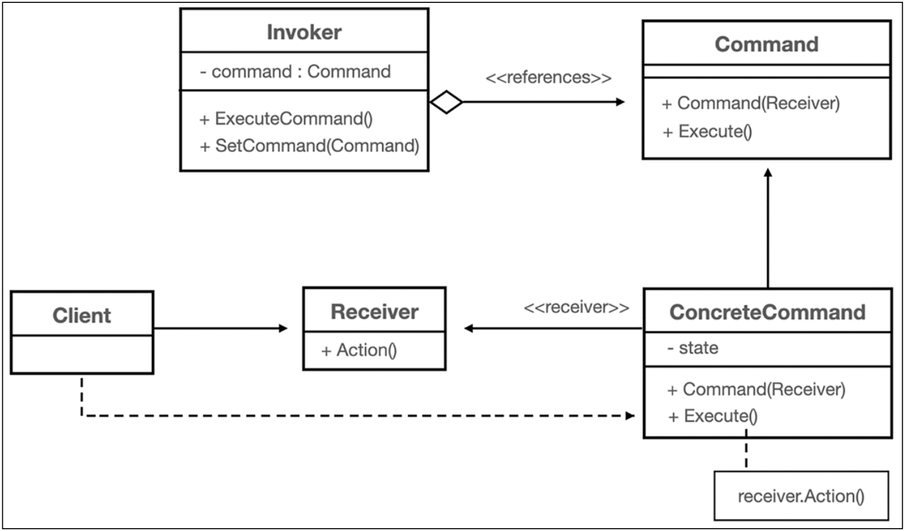

Figure 8.3 shows the UML structure of the Command design pattern with its five components:

- The **Abstract Command** class is an interface for handling operation execution
- A **Concrete Command** is responsible for executing the command on a given receiver. Commands can either be bound to a dedicated receiver or get the receiver through the Execute method. We’ll talk more about coupled and decoupled commands in the following section, Reusable versus single-use commands.
- The **Client** creates the actual command objects and passes them in their respective receivers. The example in this chapter uses a middle-man class called `InputListener`, which handles the input received from the player (via the keyboard) and returns a pre-bundled command to the client.
- The **Invoker** tells the command to execute, which means we have the freedom to decide when the command is fired.
- The **Receiver** only knows how to perform the logic behind each command, so any class can realistically be a receiver if it has the code for the corresponding command action.

### Reusable versus single-use commands

There are two kinds of commands you can use with the Command pattern (extremely important because they tend to get mashed together out in the wild).

First, you can have reusable commands, which have no state and can be passed around at will. A common example of reusable commands would be key bindings (you know them as hotkeys).

Second, you can have coupled commands, which store state information and are bound to the object receiving and performing the action. These are unique command objects, which means they can only be used once instead of being passed around at will (and are extremely loyal to their receivers). However, because they’re unique objects, they can be stored in command sequences, which means they can be undone and redone – hurray for stateful data! You’ll see RPG and tactical games use coupled commands to track player movement, especially if the player has a movement limit and wants to be able to undo or redo moves before committing to them.

### Pros and Cons of the Command pattern

Pros:

- **Decoupling** the invoker from the actor provides an intermediate level of abstraction and control. Not only is this structure less likely to break when actions or inputs are added or changed, but it also allows you to add code to keep track of commands and their order (or sequence).
- **Queued inputs** let you store, track, and control the execution of commands like an undo/redo system, macro key bindings, and command sequences.
- Commands are treated as **first-class objects** meaning they can be extended just like any other class object in our projects.

Cons:

- **Code complexity**: Setting up the Command pattern structure requires a lot of work upfront, which can be daunting and counterproductive if you’re not intentional with what you’re trying to accomplish.

## Ch 09. Decoupling Systems with the Observer Pattern

In this chapter, we’ll create an event handling system to separate the object sending information from the object, or objects, receiving that information.

At its core, the Observer pattern is a syncing machine – when data changes in one object, you want to keep any objects relying on that information up to date.

This structure creates a one-to-many relationship between the subject sending out notifications and the list of observers listening for those notifications.

The nice part is that the object sending out the bat signal that some data has changed doesn’t care who’s listening, or even if there is anyone listening. The message gets sent out just the same and the listeners are responsible for keeping action (or not) on the information they receive.

### Breaking down the Observer pattern

As part of the behavioral family of design patterns, the Observer pattern is all about communication between objects while keeping the objects sending information decoupled from the receiving objects. The Observer pattern lets you notify any listeners of specific state changes (changing values) or events (the player enters a battle) without tightly coupled references between those objects.

The Observer pattern is most useful when:

- You have an object that needs to broadcast information or changes to a variety of other objects.
- You have an object with a changing state and don’t know how many other objects need to stay up to date.
- You want to avoid tight coupling between objects that share a dependency.

Subjects hold the data we want to broadcast, and listeners are listening for any changes so they can act accordingly. The subject isn’t in charge of anything other than signaling that a change has occurred; it’s up to the listeners to decide what to do with that information on their own.

In an application or gaming scenario, you may want to notify different UI scripts of value changes so the display is synced with the data or sends out notifications when a player is hit or an enemy is destroyed.

### Diagramming the Observer pattern

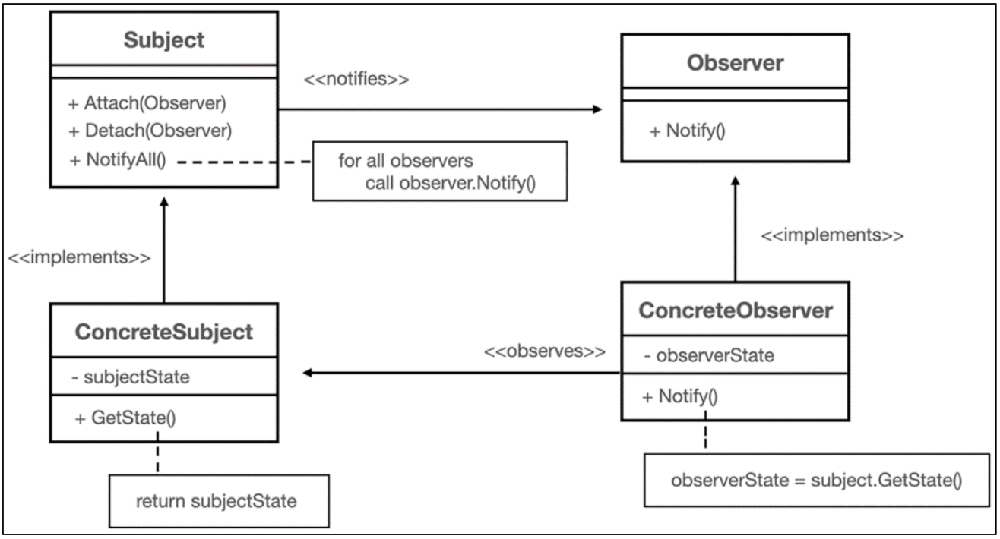

Figure 9.3 shows the UML structure of the Observer pattern with its four components:

- The **abstract subject** keeps track of all its observers and provides methods for adding and removing those observing objects.
- A **concrete subject** stores state information and notifies all observers whenever the subject’s state changes.
- The **abstract observer** has a single method for receiving and handling state changes sent from a subject.
- The **concrete observer** keeps its own state in sync with the subject it’s observing and may sometimes store a reference to the subject.

The one-to-many relationship between a subject and its observers decouples the sending object from the receiver, or receivers, which creates a clear separation of responsibility for both sides of the system while ensuring that state information is consistent between related and interested objects.

### Pros and Cons of the Observer pattern

Pros:

- **One-to-many relationships** between a subject and its list of observers allow you to create an efficient notification system while keeping the actions of each component separate and independent.
- **Light coupling** between subjects and observers is a key component of the pattern. Subjects only need a list of observers instead of specific information on the observer objects themselves, so both parts can exist in different layers or systems of your code.
  - Decoupling subjects and observers also makes the components more **reusable**.
- **Automatic broadcasting** between subjects and their observers allows you to add and remove as many observers as you want anytime you want.

Cons:

- **Unexpected changes** can cascade down a subject’s list of observers if the observers are not aware of what exactly is changing. These can be hard to track down in a distributed system like the Observer pattern, but they can be fixed by passing information to the observers about which changes are taking place, which we’ll implement later in the chapter.
- **Notification order** can be tricky with this pattern because it’s so decoupled. Traditionally, there’s no centralized hub for the subject notifications to pass through, so controlling when and in what order they are executed isn’t possible. *However, the Event Queue pattern addresses this problem, which we’ll cover in Chapter 18.*
- **Memory leaks and ghost objects** are a problem because each subject holds a list of strong references to their observers. When an observer is destroyed, it needs to be removed from the subject to free up the computing resources and avoid null references. It’s also a good idea to let observers know whether their subject has been destroyed so they can stop expecting notifications.

### Choosing a communication strategy

There is a spectrum of communication strategies that apply to the Observer pattern, but the extreme ends are simple – push or pull. The hard part is identifying the perfect sweet spot for your project because there’s no right or canon answer to this question:

- The **push** strategy is just like it sounds – the subject is responsible for pushing any additional data to the observer, but this can get complicated if a lot of information is passed without being used. Your first instinct might be to create different data parameters for each type of observer, but this significantly decreases the usefulness of the Observer pattern because it increases the coupling between the subject and observer objects.
- The **pull** strategy is the opposite – observers are in charge of grabbing whatever data they need from the subject once they are notified of a change. This scenario is completely decoupled, but it requires additional steps before the observer can execute any actions related to the subject’s notification.

### Using C# event types

The original pattern is still very useful for a one-to-many relationship between subject and observers (the waterfall analogy where you want observers to know everything happening downstream), but there are many common scenarios where that’s not enough, where observers may need to observe more than one subject at a time (we’ll call this the buffet scenario). In those many-to-many cases, we’re lucky enough to have the option of moving to native C# objects like events and Actions, which is the smart play, while the `UnityEvent` type plays better in the Unity **Inspector**.

### Delegates and events

In C#, the `delegate` type allows you to assign an entire method (with parameters, if it has any) to a variable, which in turn lets you pass the method to other methods or simply call the method programmatically. When paired with the `event` type, you have a built-in publisher-subscriber model ready to go, which is perfect for the Observer pattern; the subject is the publisher, and the observer is the subscribers. Not only that, but subscribers can also listen for as many events as they want. Unlike the waterfall model, events and delegates create a more buffet-style scenario, which is a more efficient solution when you want a more distributed Observer pattern implementation.

### Updating to Action types

`Action` types are a `delegate` and `event` package with a `void` return type; there’s just less code involved in the declaration. Calling, subscribing, and unsubscribing from an `Action` uses the same exact syntax we’ve already learned.

### UnityEvents and the Inspector

Now that we’ve exhausted ourselves with native C# types, let’s turn to the `UnityEvent` type. A `UnityEvent` works just like a C# event/delegate or action, meaning they subscribe, unsubscribe, and store a reference to a desired response when something happens. The big difference is that they can be configured in the Unity Editor, which opens a whole new world of possibilities, especially if your team has non-programmer members who need to access and test these features.

### Performance considerations

Performance is an important consideration with the Observer pattern because of its distributed and decoupled structure, so you need to pay attention to how many subjects and observers you’re going to have running around your game. Before diving into your code, run through the following list and ask yourself which solution is going to work best for your particular scenario:

- When adding listeners, a C# `event` allocates less memory than a `UnityEvent` for a single listener. However, with two or more listeners, C# `events` create exponentially more garbage than `UnityEvents`.
- When dispatching a single event, C# `events` create no garbage while `UnityEvents` generate garbage but only the first time it’s invoked.
- When dispatching tons of events (and I mean tons), C# `events` considerably outperform `UnityEvents`. Even in the best-case scenario, `UnityEvents` are likely to be at least 2x slower than C# `events`. When you add event arguments into the mix, the disparity is even greater.

### Picking the right implementation

Before we close this out, I’m going to lay out the criteria and scenarios that best fit each implementation path I’ve laid out over the last 41 pages:

- The **traditional** implementation is a great starting point, especially for scenarios with limited subjects and observers. However, this solution doesn’t add any benefits over event and Action types, so I would recommend upgrading.
- The **delegate/event or Action** implementation is a perfect way to structure your Observer pattern if you’re working primarily in code. Not only is it easier to set up and manage, but it’s also the most performant option.
- The **UnityEvent** implementation is a good fit when you need to work in the **Editor**, but this solution puts a strain on your game’s performance if you’re running a big, distributed network of subjects and listeners. However, be aware of the persistent versus non-persistent problem from the UnityEvents and the Inspector section. If you need to work in the **Editor**, I recommend upgrading to the `ScriptableObject` solution.
- The **ScriptableObject** implementation is the best fit for in-editor work. Period. Not only does it separate listeners into self-contained assets, but you can also modify non-persistent listener subscriptions in the **Editor**. However, keep in mind that `ScriptableObject` events aren’t always the easiest to organize and find in code, so you’ll need to adapt the chapter content to fit your needs.

## Ch 10. Controlling Behavior with the State Pattern

In this chapter, we’ll jump into more game mechanic territory with the State pattern to create an object that can change its behavior based on an internal state value.

Like the Command pattern, the State pattern is all about encapsulating behavior to hide the inner workings of the system from the client. The difference is how transitions between behaviors are handled. Each state is responsible for deciding when to switch states and what the next state needs to be.

You can use the State pattern in a variety of ways, but they all need a system for storing and managing the states in your game or application. We’ll start with a basic **finite-state machine (FSM)**, branch out into hierarchical and concurrent implementations, and end with a look at the importance and usability of tracking state history.

### Breaking down the State pattern

As part of the behavioral family of design patterns, the State pattern allows an object to change its internal behavior based on an internally tracked state. The internal state can be switched to any other concrete `state` object, which are self-contained classes that implement a common set of rules and customized logic. This means the State pattern is most useful when:

- You want an object’s behavior to change (either at runtime or at every frame) based on an internal state.
- You want to refactor an object’s long conditional statements into separate classes so it can be treated independently.
- You want to add new behavior to an object without changing or breaking existing code.

In the traditional State pattern, we’re more concerned with breaking different behaviors into their own self-contained states so the object can:

- Defer state-specific logic to each state.
- Allow the application to react differently depending on an object’s current state.

### A little automata theory

In contrast to the State pattern, FSMs are concerned with the states and transitions *between* states rather than the state behaviors themselves. This focus creates a fluid sequential or cyclical chain of events that almost seems tailor-made for programming scenarios, as shown in Figure 10.3.

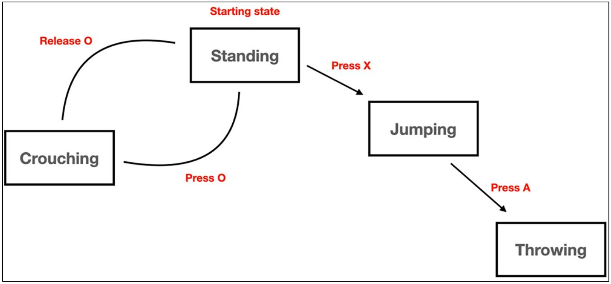

The good news is that these two concepts are not mutually exclusive (they’re actually more interlinked than some would like to admit) since the State pattern can absolutely be used to build an FSM.

So, how can you identify an FSM? Well, FSMs are studied in computer science as part of **automata theory**, are popular with AI programmers, and have the following traits:

- There are a fixed number of states our context (or state machine) can be in (i.e., running, jumping, swimming, and sitting on the couch).
- There can only be one state active at any given time (so you can’t be sitting on the couch and running a marathon).
- Events (which are generally inputs from the user) are sent to the state machine, which triggers a transition to the next state. For example, you’re on the couch hanging out (current state), you have a cup of coffee (input), and suddenly you get up and go for a run (transition to a different state).

FSMs also have useful extensions for creating hierarchies of shared behavior to avoid repeating yourself using classic object-oriented programming inheritance (called **hierarchical state machines**), behaviors that run at the same time (called **concurrent state machines**), and a handy way of storing state history for easier redo/undo actions (called **pushdown automaton**). These extensions aren’t part of the original State pattern but they do provide wonderful concrete benefits when you’re dealing with complex real-time behaviors.

### Diagramming the State pattern

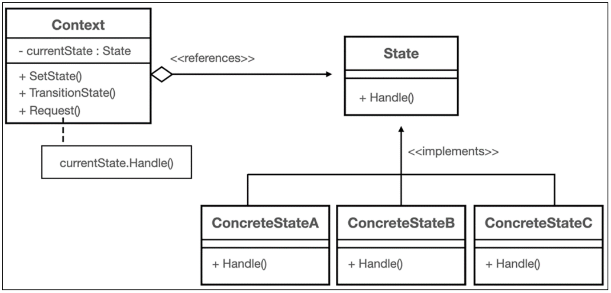

Figure 10.4 shows the UML structure of the State pattern with its three components:

- The **Context** stores the current state instance and defines the interface for clients to communicate with
- The **State** provides a common interface for all the expected state behaviors
- Each **Concrete State** is responsible for its own logic associated with each behavior or action and you can have as many Concrete States as you need.

In the pattern structure, the context delegates responsibility to the current state, which executes its customized behavior. Since each state determines how and when to transition to the next state, the context is a constant clearinghouse for the changing current state. Like other behavioral patterns we’ve used, this system lets the client use the context wherever necessary without any knowledge of the current state or how states manage themselves and their transitions.

### Pros and Cons of the State pattern

Pros:

- **Encapsulated object behavior** is a massive part of the State pattern and its biggest asset. Not only does this allow you to separate monolithic conditional statements into their own respective objects, but adding new states into the mix is much simpler and safer.
- **Because each state contains its own behavior**, it also controls its transitions to and from other states without having to query other objects. This makes each state completely self-sufficient and changes your job from herding a giant class to doing what you want, and then to defining states and transitions to form a bigger behavior picture.
- **Adding new states is easy** and doesn’t require the pattern structure or client code to change. Since states are their own masters, our job is to simply create a new state, define whatever behavior seems appropriate, and add in transitions (states can even be shared if you feel like it).

Cons:

- **Complexity** is the biggest drawback of the State pattern (as we’ve often seen with other patterns). While a system with a small number of states can be easily managed, things can quickly get out of hand the more states (and state transitions) you need to create and manage. However, this shouldn’t scare you away from using the State pattern – it’s extremely useful when building complex behavior systems that need to be self-sufficient.
